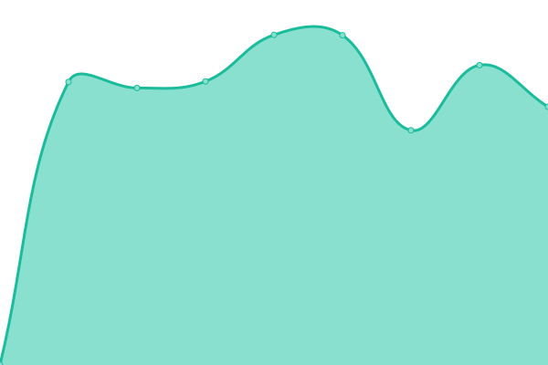

# [📈 Live Status](https://OsintUK.github.io/Up-or-Down): <!--live status--> **🟧 Partial outage**

This repository contains the open-source uptime monitor and status page for [OsintUK](https://OsintUK.github.io/Up-or-Down), powered by [Upptime](https://github.com/upptime/upptime).

With [Upptime](https://upptime.js.org), you can get your own unlimited and free uptime monitor and status page, powered entirely by a GitHub repository. We use [Issues](https://github.com/OsintUK/Up-or-Down/issues) as incident reports, [Actions](https://github.com/OsintUK/Up-or-Down/actions) as uptime monitors, and [Pages](https://OsintUK.github.io/Up-or-Down) for the status page.

<!--start: status pages-->
<!-- This summary is generated by Upptime (https://github.com/upptime/upptime) -->
<!-- Do not edit this manually, your changes will be overwritten -->
<!-- prettier-ignore -->
| URL | Status | History | Response Time | Uptime |
| --- | ------ | ------- | ------------- | ------ |
|  [Onlinecombolist](onlinecombilist.blogsport.com) | 🟥 Down | [onlinecombolist.yml](https://github.com/OsintUK/Up-or-Down/commits/HEAD/history/onlinecombolist.yml) | 

 656ms
     
 | 

<a href="https://OsintUK.github.io/Up-or-Down/history/onlinecombolist">99.05%</a>
    

|  [cweb](cweb.ws) | 🟥 Down | [cweb.yml](https://github.com/OsintUK/Up-or-Down/commits/HEAD/history/cweb.yml) | 

 0ms
     
 | 

<a href="https://OsintUK.github.io/Up-or-Down/history/cweb">0.03%</a>
    

|  [ufolabs](ufolabs.ru) | 🟥 Down | [ufolabs.yml](https://github.com/OsintUK/Up-or-Down/commits/HEAD/history/ufolabs.yml) | 

 1050ms
     
 | 

<a href="https://OsintUK.github.io/Up-or-Down/history/ufolabs">0.04%</a>
    

|  [disboard](disboard.org) | 🟥 Down | [disboard.yml](https://github.com/OsintUK/Up-or-Down/commits/HEAD/history/disboard.yml) | 

 180ms
     
 | 

<a href="https://OsintUK.github.io/Up-or-Down/history/disboard">0.01%</a>
    

|  [Infected-zone](infected-zone.com) | 🟩 Up | [infected-zone.yml](https://github.com/OsintUK/Up-or-Down/commits/HEAD/history/infected-zone.yml) | 

 1245ms
     
 | 

<a href="https://OsintUK.github.io/Up-or-Down/history/infected-zone">100.00%</a>
    

|  [Accountbot](accountbot.io) | 🟩 Up | [accountbot.yml](https://github.com/OsintUK/Up-or-Down/commits/HEAD/history/accountbot.yml) | 

 279ms
     
 | 

<a href="https://OsintUK.github.io/Up-or-Down/history/accountbot">100.00%</a>
    

|  [Amauta](amauta.cc) | 🟥 Down | [amauta.yml](https://github.com/OsintUK/Up-or-Down/commits/HEAD/history/amauta.yml) | 

 1440ms
     
 | 

<a href="https://OsintUK.github.io/Up-or-Down/history/amauta">99.70%</a>
    

|  [Bigfat](bigfat.cc) | 🟥 Down | [bigfat.yml](https://github.com/OsintUK/Up-or-Down/commits/HEAD/history/bigfat.yml) | 

 306ms
     
 | 

<a href="https://OsintUK.github.io/Up-or-Down/history/bigfat">0.02%</a>
    

|  [Bitorder](Bitorder.ru) | 🟩 Up | [bitorder.yml](https://github.com/OsintUK/Up-or-Down/commits/HEAD/history/bitorder.yml) | 

 1238ms
     
 | 

<a href="https://OsintUK.github.io/Up-or-Down/history/bitorder">100.00%</a>
    

|  [BlackHatCarding](blackhatcarding.is) | 🟥 Down | [black-hat-carding.yml](https://github.com/OsintUK/Up-or-Down/commits/HEAD/history/black-hat-carding.yml) | 

 0ms
     
 | 

<a href="https://OsintUK.github.io/Up-or-Down/history/black-hat-carding">0.02%</a>
    

|  [Breached.to](Breached.to) | 🟥 Down | [breached-to.yml](https://github.com/OsintUK/Up-or-Down/commits/HEAD/history/breached-to.yml) | 

 0ms
     
 | 

<a href="https://OsintUK.github.io/Up-or-Down/history/breached-to">0.04%</a>
    

|  [Breached.up](breached.up) | 🟥 Down | [breached-up.yml](https://github.com/OsintUK/Up-or-Down/commits/HEAD/history/breached-up.yml) | 

 0ms
     
 | 

<a href="https://OsintUK.github.io/Up-or-Down/history/breached-up">0.01%</a>
    

|  [Brianclub](Briansclub.cards) | 🟥 Down | [brianclub.yml](https://github.com/OsintUK/Up-or-Down/commits/HEAD/history/brianclub.yml) | 

 0ms
     
 | 

<a href="https://OsintUK.github.io/Up-or-Down/history/brianclub">0.02%</a>
    

|  [Ccbases](ccbases.ru) | 🟩 Up | [ccbases.yml](https://github.com/OsintUK/Up-or-Down/commits/HEAD/history/ccbases.yml) | 

 4912ms
     
 | 

<a href="https://OsintUK.github.io/Up-or-Down/history/ccbases">100.00%</a>
    

|  [CcShops](ccshops.sale) | 🟥 Down | [cc-shops.yml](https://github.com/OsintUK/Up-or-Down/commits/HEAD/history/cc-shops.yml) | 

 0ms
     
 | 

<a href="https://OsintUK.github.io/Up-or-Down/history/cc-shops">0.02%</a>
    

|  [Chopings](Chopings.cc) | 🟥 Down | [chopings.yml](https://github.com/OsintUK/Up-or-Down/commits/HEAD/history/chopings.yml) | 

 0ms
     
 | 

<a href="https://OsintUK.github.io/Up-or-Down/history/chopings">0.01%</a>
    

<!--end: status pages-->

[**Visit our status website →**](https://OsintUK.github.io/Up-or-Down)

## 📄 License

- Powered by: [Upptime](https://github.com/upptime/upptime)
- Code: [MIT](./LICENSE) © [OsintUK](https://OsintUK.github.io/Up-or-Down)
- Data in the `./history` directory: [Open Database License](https://opendatacommons.org/licenses/odbl/1-0/)
