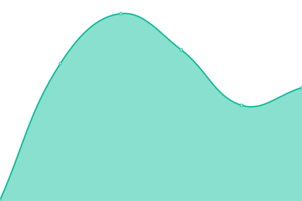

# [📈 Live Status](https://OsintUK.github.io/Up-or-Down): <!--live status--> **🟧 Partial outage**

This repository contains the open-source uptime monitor and status page for [OsintUK](https://OsintUK.github.io/Up-or-Down), powered by [Upptime](https://github.com/upptime/upptime).

With [Upptime](https://upptime.js.org), you can get your own unlimited and free uptime monitor and status page, powered entirely by a GitHub repository. We use [Issues](https://github.com/OsintUK/Up-or-Down/issues) as incident reports, [Actions](https://github.com/OsintUK/Up-or-Down/actions) as uptime monitors, and [Pages](https://OsintUK.github.io/Up-or-Down) for the status page.

<!--start: status pages-->
<!-- This summary is generated by Upptime (https://github.com/upptime/upptime) -->
<!-- Do not edit this manually, your changes will be overwritten -->
<!-- prettier-ignore -->
| URL | Status | History | Response Time | Uptime |
| --- | ------ | ------- | ------------- | ------ |
|  [Google](https://www.google.com) | 🟩 Up | [google.yml](https://github.com/OsintUK/Up-or-Down/commits/HEAD/history/google.yml) | 

 83ms
     
 | 

<a href="https://OsintUK.github.io/Up-or-Down/history/google">100.00%</a>
    

|  [Wikipedia](https://en.wikipedia.org) | 🟩 Up | [wikipedia.yml](https://github.com/OsintUK/Up-or-Down/commits/HEAD/history/wikipedia.yml) | 

 202ms
     
 | 

<a href="https://OsintUK.github.io/Up-or-Down/history/wikipedia">100.00%</a>
    

|  [Hacker News](https://news.ycombinator.com) | 🟩 Up | [hacker-news.yml](https://github.com/OsintUK/Up-or-Down/commits/HEAD/history/hacker-news.yml) | 

 288ms
     
 | 

<a href="https://OsintUK.github.io/Up-or-Down/history/hacker-news">100.00%</a>
    

|  [Test Broken Site](https://thissitedoesnotexist.koj.co) | 🟥 Down | [test-broken-site.yml](https://github.com/OsintUK/Up-or-Down/commits/HEAD/history/test-broken-site.yml) | 

 0ms
     
 | 

<a href="https://OsintUK.github.io/Up-or-Down/history/test-broken-site">1.27%</a>
    

|  [Nulled](https://nulled.to) | 🟥 Down | [nulled.yml](https://github.com/OsintUK/Up-or-Down/commits/HEAD/history/nulled.yml) | 

 122ms
     
 | 

<a href="https://OsintUK.github.io/Up-or-Down/history/nulled">3.47%</a>
    

|  [Cracked](https://cracked.io) | 🟩 Up | [cracked.yml](https://github.com/OsintUK/Up-or-Down/commits/HEAD/history/cracked.yml) | 

 853ms
     
 | 

<a href="https://OsintUK.github.io/Up-or-Down/history/cracked">100.00%</a>
    

|  [Sinister](https://sinister.ly) | 🟥 Down | [sinister.yml](https://github.com/OsintUK/Up-or-Down/commits/HEAD/history/sinister.yml) | 

 0ms
     
 | 

<a href="https://OsintUK.github.io/Up-or-Down/history/sinister">13.72%</a>
    

|  [Bhf](https://bhf.im) | 🟩 Up | [bhf.yml](https://github.com/OsintUK/Up-or-Down/commits/HEAD/history/bhf.yml) | 

 1845ms
     
 | 

<a href="https://OsintUK.github.io/Up-or-Down/history/bhf">100.00%</a>
    

|  [ChitaChok](https://chitachok.fun) | 🟩 Up | [chita-chok.yml](https://github.com/OsintUK/Up-or-Down/commits/HEAD/history/chita-chok.yml) | 

 2157ms
     
 | 

<a href="https://OsintUK.github.io/Up-or-Down/history/chita-chok">100.00%</a>
    

|  [CrackingItaly](https://crackingitaly.to) | 🟩 Up | [cracking-italy.yml](https://github.com/OsintUK/Up-or-Down/commits/HEAD/history/cracking-italy.yml) | 

 628ms
     
 | 

<a href="https://OsintUK.github.io/Up-or-Down/history/cracking-italy">100.00%</a>
    

|  [Patched](https://patched.to) | 🟥 Down | [patched.yml](https://github.com/OsintUK/Up-or-Down/commits/HEAD/history/patched.yml) | 

 351ms
     
 | 

<a href="https://OsintUK.github.io/Up-or-Down/history/patched">12.87%</a>
    

|  [CrdClub](https://crdclub.su) | 🟩 Up | [crd-club.yml](https://github.com/OsintUK/Up-or-Down/commits/HEAD/history/crd-club.yml) | 

 1267ms
     
 | 

<a href="https://OsintUK.github.io/Up-or-Down/history/crd-club">100.00%</a>
    

<!--end: status pages-->

[**Visit our status website →**](https://OsintUK.github.io/Up-or-Down)

## 📄 License

- Powered by: [Upptime](https://github.com/upptime/upptime)
- Code: [MIT](./LICENSE) © [OsintUK](https://OsintUK.github.io/Up-or-Down)
- Data in the `./history` directory: [Open Database License](https://opendatacommons.org/licenses/odbl/1-0/)
