# [📈 Live Status](https://OsintUK.github.io/Up-or-Down): <!--live status--> **🟧 Partial outage**

To see the full list of forums, open the README.MD file

This repository contains the open-source uptime monitor and status page for [OsintUK](https://OsintUK.github.io/Up-or-Down), powered by [Upptime](https://github.com/upptime/upptime).

With [Upptime](https://upptime.js.org), you can get your own unlimited and free uptime monitor and status page, powered entirely by a GitHub repository. We use [Issues](https://github.com/OsintUK/Up-or-Down/issues) as incident reports, [Actions](https://github.com/OsintUK/Up-or-Down/actions) as uptime monitors, and [Pages](https://OsintUK.github.io/Up-or-Down) for the status page.

<!--start: status pages-->
<!-- This summary is generated by Upptime (https://github.com/upptime/upptime) -->
<!-- Do not edit this manually, your changes will be overwritten -->
<!-- prettier-ignore -->
| URL | Status | History | Response Time | Uptime |
| --- | ------ | ------- | ------------- | ------ |
|  [Cracked](https://cracked.io) | 🟩 Up | [cracked.yml](https://github.com/OsintUK/Up-or-Down/commits/HEAD/history/cracked.yml) | 

 958ms
     
 | 

<a href="https://OsintUK.github.io/Up-or-Down/history/cracked">87.21%</a>
    

|  [Sinister](http://sinister.ly/index.php) | 🟩 Up | [sinister.yml](https://github.com/OsintUK/Up-or-Down/commits/HEAD/history/sinister.yml) | 

 1664ms
     
 | 

<a href="https://OsintUK.github.io/Up-or-Down/history/sinister">100.00%</a>
    

|  [CrackingItaly](https://crackingitaly.to) | 🟩 Up | [cracking-italy.yml](https://github.com/OsintUK/Up-or-Down/commits/HEAD/history/cracking-italy.yml) | 

 1499ms
     
 | 

<a href="https://OsintUK.github.io/Up-or-Down/history/cracking-italy">100.00%</a>
    

|  [Breached SV](https://breached.vc/) | 🟩 Up | [breached-sv.yml](https://github.com/OsintUK/Up-or-Down/commits/HEAD/history/breached-sv.yml) | 

 1347ms
     
 | 

<a href="https://OsintUK.github.io/Up-or-Down/history/breached-sv">92.12%</a>
    

|  [Patched](https://patched.to) | 🟩 Up | [patched.yml](https://github.com/OsintUK/Up-or-Down/commits/HEAD/history/patched.yml) | 

 201ms
     
 | 

<a href="https://OsintUK.github.io/Up-or-Down/history/patched">100.00%</a>
    

|  [CrdClub](https://crdclub.su) | 🟩 Up | [crd-club.yml](https://github.com/OsintUK/Up-or-Down/commits/HEAD/history/crd-club.yml) | 

 1809ms
     
 | 

<a href="https://OsintUK.github.io/Up-or-Down/history/crd-club">93.62%</a>
    

|  [Nohide](https://nohide.space) | 🟩 Up | [nohide.yml](https://github.com/OsintUK/Up-or-Down/commits/HEAD/history/nohide.yml) | 

 148ms
     
 | 

<a href="https://OsintUK.github.io/Up-or-Down/history/nohide">100.00%</a>
    

|  [DarkNetWeb](https://darknetweb.ru) | 🟩 Up | [dark-net-web.yml](https://github.com/OsintUK/Up-or-Down/commits/HEAD/history/dark-net-web.yml) | 

 1629ms
     
 | 

<a href="https://OsintUK.github.io/Up-or-Down/history/dark-net-web">93.64%</a>
    

|  [CCCCC](https://ccccc.sb) | 🟨 Degraded | [ccccc.yml](https://github.com/OsintUK/Up-or-Down/commits/HEAD/history/ccccc.yml) | 

 8122ms
     
 | 

<a href="https://OsintUK.github.io/Up-or-Down/history/ccccc">0.00%</a>
    

|  [Moon](http://moon.sb) | 🟨 Degraded | [moon.yml](https://github.com/OsintUK/Up-or-Down/commits/HEAD/history/moon.yml) | 

 9322ms
     
 | 

<a href="https://OsintUK.github.io/Up-or-Down/history/moon">14.24%</a>
    

|  [Cracking](https://cracking.org) | 🟩 Up | [cracking.yml](https://github.com/OsintUK/Up-or-Down/commits/HEAD/history/cracking.yml) | 

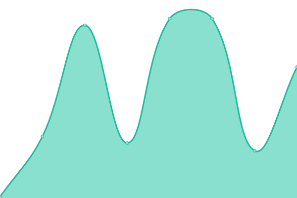 179ms
     
 | 

<a href="https://OsintUK.github.io/Up-or-Down/history/cracking">1.37%</a>
    

|  [Telegago](https://cse.google.com/cse?&cx=006368593537057042503:efxu7xprihg#gsc.tab=0) | 🟩 Up | [telegago.yml](https://github.com/OsintUK/Up-or-Down/commits/HEAD/history/telegago.yml) | 

 87ms
     
 | 

<a href="https://OsintUK.github.io/Up-or-Down/history/telegago">100.00%</a>
    

|  [Shellix](https://shellix.xyz) | 🟩 Up | [shellix.yml](https://github.com/OsintUK/Up-or-Down/commits/HEAD/history/shellix.yml) | 

 313ms
     
 | 

<a href="https://OsintUK.github.io/Up-or-Down/history/shellix">100.00%</a>
    

|  [Cracked.sx](https://cracked.sx) | 🟩 Up | [cracked-sx.yml](https://github.com/OsintUK/Up-or-Down/commits/HEAD/history/cracked-sx.yml) | 

 1476ms
     
 | 

<a href="https://OsintUK.github.io/Up-or-Down/history/cracked-sx">100.00%</a>
    

|  [Crackia](https://crackia.com) | 🟩 Up | [crackia.yml](https://github.com/OsintUK/Up-or-Down/commits/HEAD/history/crackia.yml) | 

 91ms
     
 | 

<a href="https://OsintUK.github.io/Up-or-Down/history/crackia">100.00%</a>
    

|  [NulledBB](https://nulledbb.com) | 🟩 Up | [nulled-bb.yml](https://github.com/OsintUK/Up-or-Down/commits/HEAD/history/nulled-bb.yml) | 

 3804ms
     
 | 

<a href="https://OsintUK.github.io/Up-or-Down/history/nulled-bb">100.00%</a>
    

|  [Ufolabs](https://ufolabs.net) | 🟩 Up | [ufolabs.yml](https://github.com/OsintUK/Up-or-Down/commits/HEAD/history/ufolabs.yml) | 

 679ms
     
 | 

<a href="https://OsintUK.github.io/Up-or-Down/history/ufolabs">100.00%</a>
    

|  [Disboard](https://disboard.org) | 🟩 Up | [disboard.yml](https://github.com/OsintUK/Up-or-Down/commits/HEAD/history/disboard.yml) | 

 185ms
     
 | 

<a href="https://OsintUK.github.io/Up-or-Down/history/disboard">100.00%</a>
    

|  [Infected-zone](https://Infected-zone.com) | 🟩 Up | [infected-zone.yml](https://github.com/OsintUK/Up-or-Down/commits/HEAD/history/infected-zone.yml) | 

 877ms
     
 | 

<a href="https://OsintUK.github.io/Up-or-Down/history/infected-zone">100.00%</a>
    

|  [AcountBot](https://accountbot.io) | 🟩 Up | [acount-bot.yml](https://github.com/OsintUK/Up-or-Down/commits/HEAD/history/acount-bot.yml) | 

 482ms
     
 | 

<a href="https://OsintUK.github.io/Up-or-Down/history/acount-bot">100.00%</a>
    

|  [BigFat](https://bigfat.cc) | 🟩 Up | [big-fat.yml](https://github.com/OsintUK/Up-or-Down/commits/HEAD/history/big-fat.yml) | 

 86ms
     
 | 

<a href="https://OsintUK.github.io/Up-or-Down/history/big-fat">100.00%</a>
    

|  [BitOrder](http://Bitorder.ru) | 🟩 Up | [bit-order.yml](https://github.com/OsintUK/Up-or-Down/commits/HEAD/history/bit-order.yml) | 

 1364ms
     
 | 

<a href="https://OsintUK.github.io/Up-or-Down/history/bit-order">100.00%</a>
    

|  [BlackHatCarding](https://blackhatcarding.is) | 🟥 Down | [black-hat-carding.yml](https://github.com/OsintUK/Up-or-Down/commits/HEAD/history/black-hat-carding.yml) | 

 0ms
     
 | 

<a href="https://OsintUK.github.io/Up-or-Down/history/black-hat-carding">100.00%</a>
    

|  [CCshops](https://ccshops.sale) | 🟥 Down | [c-cshops.yml](https://github.com/OsintUK/Up-or-Down/commits/HEAD/history/c-cshops.yml) | 

 0ms
     
 | 

<a href="https://OsintUK.github.io/Up-or-Down/history/c-cshops">100.00%</a>
    

|  [BriansClub](https://Briansclub.cards) | 🟥 Down | [brians-club.yml](https://github.com/OsintUK/Up-or-Down/commits/HEAD/history/brians-club.yml) | 

 0ms
     
 | 

<a href="https://OsintUK.github.io/Up-or-Down/history/brians-club">100.00%</a>
    

|  [Chopings](https://Chopings.cc) | 🟥 Down | [chopings.yml](https://github.com/OsintUK/Up-or-Down/commits/HEAD/history/chopings.yml) | 

 0ms
     
 | 

<a href="https://OsintUK.github.io/Up-or-Down/history/chopings">100.00%</a>
    

|  [Darknet](https://darknet.ug) | 🟩 Up | [darknet.yml](https://github.com/OsintUK/Up-or-Down/commits/HEAD/history/darknet.yml) | 

 4978ms
     
 | 

<a href="https://OsintUK.github.io/Up-or-Down/history/darknet">100.00%</a>
    

|  [Fssquad](https://fssquad.com) | 🟩 Up | [fssquad.yml](https://github.com/OsintUK/Up-or-Down/commits/HEAD/history/fssquad.yml) | 

 1154ms
     
 | 

<a href="https://OsintUK.github.io/Up-or-Down/history/fssquad">100.00%</a>
    

|  [Bitify](https://bitify.com) | 🟩 Up | [bitify.yml](https://github.com/OsintUK/Up-or-Down/commits/HEAD/history/bitify.yml) | 

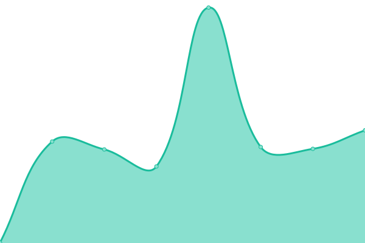 336ms
     
 | 

<a href="https://OsintUK.github.io/Up-or-Down/history/bitify">100.00%</a>
    

|  [Criminalz](https://criminalz.org/) | 🟩 Up | [criminalz.yml](https://github.com/OsintUK/Up-or-Down/commits/HEAD/history/criminalz.yml) | 

 187ms
     
 | 

<a href="https://OsintUK.github.io/Up-or-Down/history/criminalz">100.00%</a>
    

|  [lolz](https://lolz.guru) | 🟩 Up | [lolz.yml](https://github.com/OsintUK/Up-or-Down/commits/HEAD/history/lolz.yml) | 

 1778ms
     
 | 

<a href="https://OsintUK.github.io/Up-or-Down/history/lolz">100.00%</a>
    

|  [Vlmi](https://vlmi.ws) | 🟩 Up | [vlmi.yml](https://github.com/OsintUK/Up-or-Down/commits/HEAD/history/vlmi.yml) | 

 214ms
     
 | 

<a href="https://OsintUK.github.io/Up-or-Down/history/vlmi">100.00%</a>
    

|  [OpenCard](https://opencard.top) | 🟩 Up | [open-card.yml](https://github.com/OsintUK/Up-or-Down/commits/HEAD/history/open-card.yml) | 

 2579ms
     
 | 

<a href="https://OsintUK.github.io/Up-or-Down/history/open-card">100.00%</a>
    

|  [Xreactor](https://xreactor.org) | 🟩 Up | [xreactor.yml](https://github.com/OsintUK/Up-or-Down/commits/HEAD/history/xreactor.yml) | 

 376ms
     
 | 

<a href="https://OsintUK.github.io/Up-or-Down/history/xreactor">100.00%</a>
    

|  [CrackingX](https://crackingx.com) | 🟩 Up | [cracking-x.yml](https://github.com/OsintUK/Up-or-Down/commits/HEAD/history/cracking-x.yml) | 

 893ms
     
 | 

<a href="https://OsintUK.github.io/Up-or-Down/history/cracking-x">100.00%</a>
    

|  [BdfClub](https://bdfclub.com) | 🟩 Up | [bdf-club.yml](https://github.com/OsintUK/Up-or-Down/commits/HEAD/history/bdf-club.yml) | 

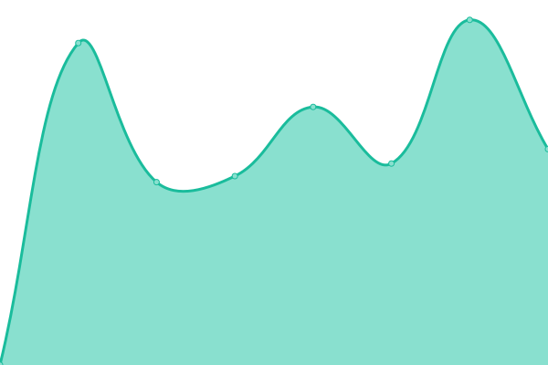 1109ms
     
 | 

<a href="https://OsintUK.github.io/Up-or-Down/history/bdf-club">92.09%</a>
    

|  [DrDark](https://drdark.ru) | 🟩 Up | [dr-dark.yml](https://github.com/OsintUK/Up-or-Down/commits/HEAD/history/dr-dark.yml) | 

 1291ms
     
 | 

<a href="https://OsintUK.github.io/Up-or-Down/history/dr-dark">93.65%</a>
    

|  [CrackingHits](https://crackinghits.to) | 🟩 Up | [cracking-hits.yml](https://github.com/OsintUK/Up-or-Down/commits/HEAD/history/cracking-hits.yml) | 

 3241ms
     
 | 

<a href="https://OsintUK.github.io/Up-or-Down/history/cracking-hits">100.00%</a>
    

|  [ForumTeam](https://forumteam.top) | 🟩 Up | [forum-team.yml](https://github.com/OsintUK/Up-or-Down/commits/HEAD/history/forum-team.yml) | 

 1254ms
     
 | 

<a href="https://OsintUK.github.io/Up-or-Down/history/forum-team">100.00%</a>
    

|  [Altenens](https://altenens.is/) | 🟥 Down | [altenens.yml](https://github.com/OsintUK/Up-or-Down/commits/HEAD/history/altenens.yml) | 

 0ms
     
 | 

<a href="https://OsintUK.github.io/Up-or-Down/history/altenens">100.00%</a>
    

|  [CraxPro](https://craxpro.io) | 🟩 Up | [crax-pro.yml](https://github.com/OsintUK/Up-or-Down/commits/HEAD/history/crax-pro.yml) | 

 165ms
     
 | 

<a href="https://OsintUK.github.io/Up-or-Down/history/crax-pro">100.00%</a>
    

|  [DarkNet](http://darknet.tw) | 🟩 Up | [dark-net.yml](https://github.com/OsintUK/Up-or-Down/commits/HEAD/history/dark-net.yml) | 

 3104ms
     
 | 

<a href="https://OsintUK.github.io/Up-or-Down/history/dark-net">100.00%</a>
    

|  [Dark-time](https://dark-time.com) | 🟩 Up | [dark-time.yml](https://github.com/OsintUK/Up-or-Down/commits/HEAD/history/dark-time.yml) | 

 95ms
     
 | 

<a href="https://OsintUK.github.io/Up-or-Down/history/dark-time">100.00%</a>
    

|  [Cashoutgod](https://cashoutgod.ru) | 🟩 Up | [cashoutgod.yml](https://github.com/OsintUK/Up-or-Down/commits/HEAD/history/cashoutgod.yml) | 

 3986ms
     
 | 

<a href="https://OsintUK.github.io/Up-or-Down/history/cashoutgod">100.00%</a>
    

|  [CyberNulled](https://cybernulled.com) | 🟩 Up | [cyber-nulled.yml](https://github.com/OsintUK/Up-or-Down/commits/HEAD/history/cyber-nulled.yml) | 

 105ms
     
 | 

<a href="https://OsintUK.github.io/Up-or-Down/history/cyber-nulled">100.00%</a>
    

|  [Gerki](https://gerki.pw) | 🟩 Up | [gerki.yml](https://github.com/OsintUK/Up-or-Down/commits/HEAD/history/gerki.yml) | 

 1121ms
     
 | 

<a href="https://OsintUK.github.io/Up-or-Down/history/gerki">100.00%</a>
    

|  [Niflheim](https://niflheim.top) | 🟩 Up | [niflheim.yml](https://github.com/OsintUK/Up-or-Down/commits/HEAD/history/niflheim.yml) | 

 1456ms
     
 | 

<a href="https://OsintUK.github.io/Up-or-Down/history/niflheim">100.00%</a>
    

|  [X-Slayer](https://x-slayer.fun) | 🟩 Up | [x-slayer.yml](https://github.com/OsintUK/Up-or-Down/commits/HEAD/history/x-slayer.yml) | 

 776ms
     
 | 

<a href="https://OsintUK.github.io/Up-or-Down/history/x-slayer">100.00%</a>
    

|  [Illegals](https://illegals.online) | 🟩 Up | [illegals.yml](https://github.com/OsintUK/Up-or-Down/commits/HEAD/history/illegals.yml) | 

 83ms
     
 | 

<a href="https://OsintUK.github.io/Up-or-Down/history/illegals">100.00%</a>
    

|  [LeetForums](https://leetforums.ru) | 🟩 Up | [leet-forums.yml](https://github.com/OsintUK/Up-or-Down/commits/HEAD/history/leet-forums.yml) | 

 1563ms
     
 | 

<a href="https://OsintUK.github.io/Up-or-Down/history/leet-forums">93.66%</a>
    

|  [EmailPass](https://emailpass.xyz) | 🟩 Up | [email-pass.yml](https://github.com/OsintUK/Up-or-Down/commits/HEAD/history/email-pass.yml) | 

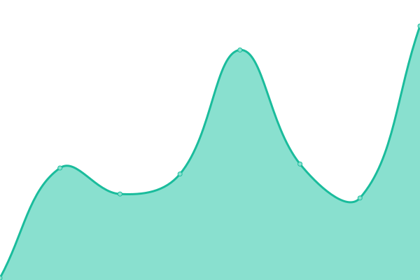 114ms
     
 | 

<a href="https://OsintUK.github.io/Up-or-Down/history/email-pass">100.00%</a>
    

|  [NoobsCracking](https://noobscracking.weebly.com) | 🟩 Up | [noobs-cracking.yml](https://github.com/OsintUK/Up-or-Down/commits/HEAD/history/noobs-cracking.yml) | 

 630ms
     
 | 

<a href="https://OsintUK.github.io/Up-or-Down/history/noobs-cracking">100.00%</a>
    

|  [Novara](https://novara.biz) | 🟩 Up | [novara.yml](https://github.com/OsintUK/Up-or-Down/commits/HEAD/history/novara.yml) | 

 2566ms
     
 | 

<a href="https://OsintUK.github.io/Up-or-Down/history/novara">100.00%</a>
    

|  [V3rmillion](https://v3rmillion.net) | 🟩 Up | [v3rmillion.yml](https://github.com/OsintUK/Up-or-Down/commits/HEAD/history/v3rmillion.yml) | 

 88ms
     
 | 

<a href="https://OsintUK.github.io/Up-or-Down/history/v3rmillion">100.00%</a>
    

|  [CrackingAll](https://crackingall.com) | 🟥 Down | [cracking-all.yml](https://github.com/OsintUK/Up-or-Down/commits/HEAD/history/cracking-all.yml) | 

 864ms
     
 | 

<a href="https://OsintUK.github.io/Up-or-Down/history/cracking-all">27.20%</a>
    

|  [Selkis](https://selkis.online/) | 🟩 Up | [selkis.yml](https://github.com/OsintUK/Up-or-Down/commits/HEAD/history/selkis.yml) | 

 89ms
     
 | 

<a href="https://OsintUK.github.io/Up-or-Down/history/selkis">100.00%</a>
    

|  [HackPortals](https://hackportals.org) | 🟩 Up | [hack-portals.yml](https://github.com/OsintUK/Up-or-Down/commits/HEAD/history/hack-portals.yml) | 

 1136ms
     
 | 

<a href="https://OsintUK.github.io/Up-or-Down/history/hack-portals">100.00%</a>
    

|  [CrackerTeam](https://crackerteam.com/) | 🟩 Up | [cracker-team.yml](https://github.com/OsintUK/Up-or-Down/commits/HEAD/history/cracker-team.yml) | 

 91ms
     
 | 

<a href="https://OsintUK.github.io/Up-or-Down/history/cracker-team">100.00%</a>
    

|  [CrimeMarket](https://crimemarket.is/) | 🟩 Up | [crime-market.yml](https://github.com/OsintUK/Up-or-Down/commits/HEAD/history/crime-market.yml) | 

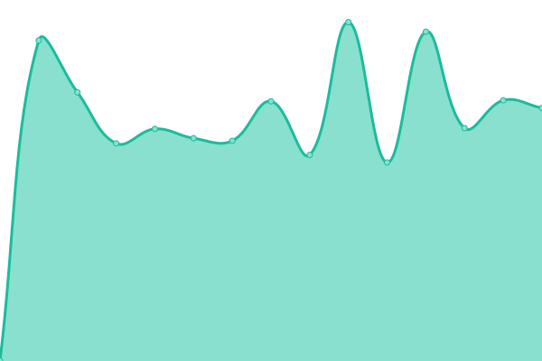 938ms
     
 | 

<a href="https://OsintUK.github.io/Up-or-Down/history/crime-market">100.00%</a>
    

|  [DarkHack](https://darkhack.org) | 🟩 Up | [dark-hack.yml](https://github.com/OsintUK/Up-or-Down/commits/HEAD/history/dark-hack.yml) | 

 185ms
     
 | 

<a href="https://OsintUK.github.io/Up-or-Down/history/dark-hack">100.00%</a>
    

|  [CrackingIsland](https://crackingisland.com) | 🟩 Up | [cracking-island.yml](https://github.com/OsintUK/Up-or-Down/commits/HEAD/history/cracking-island.yml) | 

 672ms
     
 | 

<a href="https://OsintUK.github.io/Up-or-Down/history/cracking-island">85.70%</a>
    

|  [Lumix](https://lumix.live) | 🟩 Up | [lumix.yml](https://github.com/OsintUK/Up-or-Down/commits/HEAD/history/lumix.yml) | 

 292ms
     
 | 

<a href="https://OsintUK.github.io/Up-or-Down/history/lumix">100.00%</a>
    

|  [OpenBullet Shop](https://openbullet.shop) | 🟩 Up | [open-bullet-shop.yml](https://github.com/OsintUK/Up-or-Down/commits/HEAD/history/open-bullet-shop.yml) | 

 861ms
     
 | 

<a href="https://OsintUK.github.io/Up-or-Down/history/open-bullet-shop">100.00%</a>
    

|  [VoidForum](https://voidforum.com) | 🟩 Up | [void-forum.yml](https://github.com/OsintUK/Up-or-Down/commits/HEAD/history/void-forum.yml) | 

 1376ms
     
 | 

<a href="https://OsintUK.github.io/Up-or-Down/history/void-forum">100.00%</a>
    

|  [BuyCVVdumps](https://buycvvdumps.org) | 🟩 Up | [buy-cv-vdumps.yml](https://github.com/OsintUK/Up-or-Down/commits/HEAD/history/buy-cv-vdumps.yml) | 

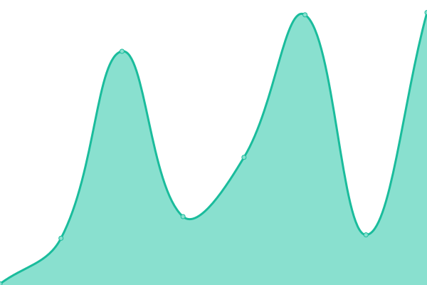 187ms
     
 | 

<a href="https://OsintUK.github.io/Up-or-Down/history/buy-cv-vdumps">100.00%</a>
    

|  [CardingLeaks](https://cardingleaks.ws) | 🟩 Up | [carding-leaks.yml](https://github.com/OsintUK/Up-or-Down/commits/HEAD/history/carding-leaks.yml) | 

 554ms
     
 | 

<a href="https://OsintUK.github.io/Up-or-Down/history/carding-leaks">100.00%</a>
    

|  [CrackerMain](https://crackermain.com) | 🟩 Up | [cracker-main.yml](https://github.com/OsintUK/Up-or-Down/commits/HEAD/history/cracker-main.yml) | 

 99ms
     
 | 

<a href="https://OsintUK.github.io/Up-or-Down/history/cracker-main">100.00%</a>
    

|  [DemonForums](https://demonforums.net) | 🟩 Up | [demon-forums.yml](https://github.com/OsintUK/Up-or-Down/commits/HEAD/history/demon-forums.yml) | 

 1986ms
     
 | 

<a href="https://OsintUK.github.io/Up-or-Down/history/demon-forums">100.00%</a>
    

|  [Hackonology](https://hackonology.com) | 🟩 Up | [hackonology.yml](https://github.com/OsintUK/Up-or-Down/commits/HEAD/history/hackonology.yml) | 

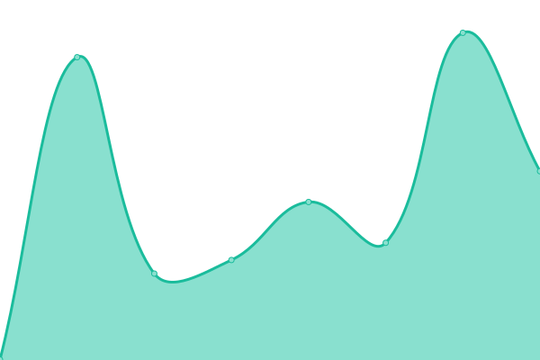 352ms
     
 | 

<a href="https://OsintUK.github.io/Up-or-Down/history/hackonology">100.00%</a>
    

|  [LeakForum](https://leakforum.org) | 🟩 Up | [leak-forum.yml](https://github.com/OsintUK/Up-or-Down/commits/HEAD/history/leak-forum.yml) | 

 1237ms
     
 | 

<a href="https://OsintUK.github.io/Up-or-Down/history/leak-forum">100.00%</a>
    

|  [LeakZone](https://leakzone.net) | 🟩 Up | [leak-zone.yml](https://github.com/OsintUK/Up-or-Down/commits/HEAD/history/leak-zone.yml) | 

 2109ms
     
 | 

<a href="https://OsintUK.github.io/Up-or-Down/history/leak-zone">100.00%</a>
    

|  [LearnToCrack](https://learntocrack.com) | 🟩 Up | [learn-to-crack.yml](https://github.com/OsintUK/Up-or-Down/commits/HEAD/history/learn-to-crack.yml) | 

 414ms
     
 | 

<a href="https://OsintUK.github.io/Up-or-Down/history/learn-to-crack">100.00%</a>
    

|  [LegitCarder](https://legitcarder.ru) | 🟩 Up | [legit-carder.yml](https://github.com/OsintUK/Up-or-Down/commits/HEAD/history/legit-carder.yml) | 

 1412ms
     
 | 

<a href="https://OsintUK.github.io/Up-or-Down/history/legit-carder">100.00%</a>
    

|  [Orvx](https://orvx.pw) | 🟩 Up | [orvx.yml](https://github.com/OsintUK/Up-or-Down/commits/HEAD/history/orvx.yml) | 

 895ms
     
 | 

<a href="https://OsintUK.github.io/Up-or-Down/history/orvx">100.00%</a>
    

|  [Shoppy](https://shoppy.gg) | 🟩 Up | [shoppy.yml](https://github.com/OsintUK/Up-or-Down/commits/HEAD/history/shoppy.yml) | 

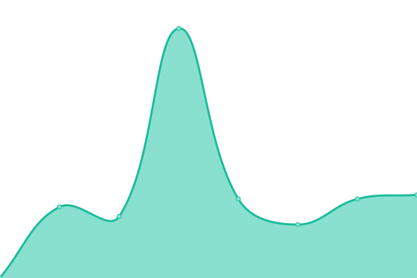 334ms
     
 | 

<a href="https://OsintUK.github.io/Up-or-Down/history/shoppy">100.00%</a>
    

|  [SinfulSite](https://sinfulsite.com) | 🟩 Up | [sinful-site.yml](https://github.com/OsintUK/Up-or-Down/commits/HEAD/history/sinful-site.yml) | 

 2943ms
     
 | 

<a href="https://OsintUK.github.io/Up-or-Down/history/sinful-site">100.00%</a>
    

|  [AnonFiles](https://anonfiles.com) | 🟩 Up | [anon-files.yml](https://github.com/OsintUK/Up-or-Down/commits/HEAD/history/anon-files.yml) | 

 727ms
     
 | 

<a href="https://OsintUK.github.io/Up-or-Down/history/anon-files">92.06%</a>
    

|  [Ascarding](https://ascarding.com) | 🟩 Up | [ascarding.yml](https://github.com/OsintUK/Up-or-Down/commits/HEAD/history/ascarding.yml) | 

 732ms
     
 | 

<a href="https://OsintUK.github.io/Up-or-Down/history/ascarding">100.00%</a>
    

|  [BigBossCarding](https://bigbosscarding.com) | 🟥 Down | [big-boss-carding.yml](https://github.com/OsintUK/Up-or-Down/commits/HEAD/history/big-boss-carding.yml) | 

 0ms
     
 | 

<a href="https://OsintUK.github.io/Up-or-Down/history/big-boss-carding">0.00%</a>
    

|  [BuyDumpsCVV](https://buydumpscvv.com) | 🟩 Up | [buy-dumps-cvv.yml](https://github.com/OsintUK/Up-or-Down/commits/HEAD/history/buy-dumps-cvv.yml) | 

 2035ms
     
 | 

<a href="https://OsintUK.github.io/Up-or-Down/history/buy-dumps-cvv">100.00%</a>
    

|  [BuyPageScript](https://buypagescript.com) | 🟩 Up | [buy-page-script.yml](https://github.com/OsintUK/Up-or-Down/commits/HEAD/history/buy-page-script.yml) | 

 8633ms
     
 | 

<a href="https://OsintUK.github.io/Up-or-Down/history/buy-page-script">100.00%</a>
    

|  [CrackiansLeaks](https://crackiansleaks.com) | 🟩 Up | [crackians-leaks.yml](https://github.com/OsintUK/Up-or-Down/commits/HEAD/history/crackians-leaks.yml) | 

 433ms
     
 | 

<a href="https://OsintUK.github.io/Up-or-Down/history/crackians-leaks">100.00%</a>
    

|  [CrackingPro](https://crackingpro.com) | 🟩 Up | [cracking-pro.yml](https://github.com/OsintUK/Up-or-Down/commits/HEAD/history/cracking-pro.yml) | 

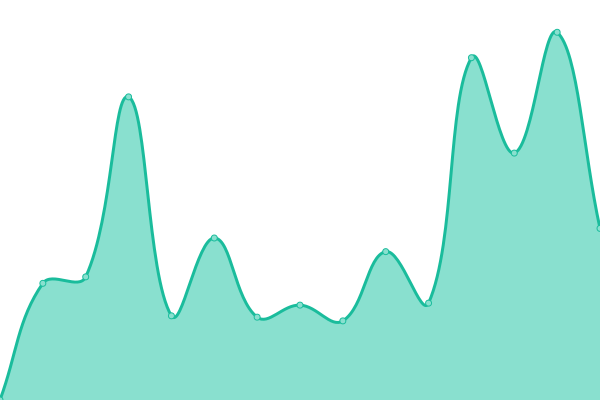 5715ms
     
 | 

<a href="https://OsintUK.github.io/Up-or-Down/history/cracking-pro">100.00%</a>
    

|  [CrewgamBlogspot](https://crewgam.blogspot.com) | 🟩 Up | [crewgam-blogspot.yml](https://github.com/OsintUK/Up-or-Down/commits/HEAD/history/crewgam-blogspot.yml) | 

 329ms
     
 | 

<a href="https://OsintUK.github.io/Up-or-Down/history/crewgam-blogspot">100.00%</a>
    

|  [CyberCarders](https://cybercarders.com) | 🟩 Up | [cyber-carders.yml](https://github.com/OsintUK/Up-or-Down/commits/HEAD/history/cyber-carders.yml) | 

 95ms
     
 | 

<a href="https://OsintUK.github.io/Up-or-Down/history/cyber-carders">100.00%</a>
    

|  [DarkPro](https://darkpro.net) | 🟩 Up | [dark-pro.yml](https://github.com/OsintUK/Up-or-Down/commits/HEAD/history/dark-pro.yml) | 

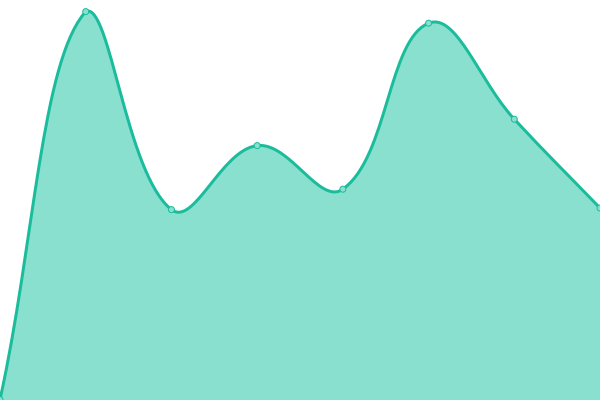 622ms
     
 | 

<a href="https://OsintUK.github.io/Up-or-Down/history/dark-pro">100.00%</a>
    

|  [Leech](https://leech.is) | 🟩 Up | [leech.yml](https://github.com/OsintUK/Up-or-Down/commits/HEAD/history/leech.yml) | 

 1922ms
     
 | 

<a href="https://OsintUK.github.io/Up-or-Down/history/leech">100.00%</a>
    

|  [LegitCarders](https://legitcarders.ws) | 🟩 Up | [legit-carders.yml](https://github.com/OsintUK/Up-or-Down/commits/HEAD/history/legit-carders.yml) | 

 710ms
     
 | 

<a href="https://OsintUK.github.io/Up-or-Down/history/legit-carders">100.00%</a>
    

|  [UnlistedLeaks](https://unlistedleaks.su) | 🟩 Up | [unlisted-leaks.yml](https://github.com/OsintUK/Up-or-Down/commits/HEAD/history/unlisted-leaks.yml) | 

 1954ms
     
 | 

<a href="https://OsintUK.github.io/Up-or-Down/history/unlisted-leaks">100.00%</a>
    

|  [VerifiedCarder](https://verifiedcarder.net) | 🟩 Up | [verified-carder.yml](https://github.com/OsintUK/Up-or-Down/commits/HEAD/history/verified-carder.yml) | 

 803ms
     
 | 

<a href="https://OsintUK.github.io/Up-or-Down/history/verified-carder">92.12%</a>
    

|  [AccsMarket](https://accsmarket.com) | 🟩 Up | [accs-market.yml](https://github.com/OsintUK/Up-or-Down/commits/HEAD/history/accs-market.yml) | 

 11663ms
     
 | 

<a href="https://OsintUK.github.io/Up-or-Down/history/accs-market">100.00%</a>
    

|  [B117](https://b117x.com) | 🟩 Up | [b117.yml](https://github.com/OsintUK/Up-or-Down/commits/HEAD/history/b117.yml) | 

 347ms
     
 | 

<a href="https://OsintUK.github.io/Up-or-Down/history/b117">93.58%</a>
    

|  [BpcForum](https://bpcforum.ru) | 🟩 Up | [bpc-forum.yml](https://github.com/OsintUK/Up-or-Down/commits/HEAD/history/bpc-forum.yml) | 

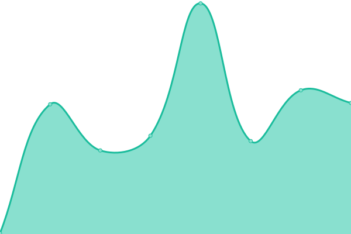 201ms
     
 | 

<a href="https://OsintUK.github.io/Up-or-Down/history/bpc-forum">100.00%</a>
    

|  [CrackingForum](https://crackingforum.to) | 🟩 Up | [cracking-forum.yml](https://github.com/OsintUK/Up-or-Down/commits/HEAD/history/cracking-forum.yml) | 

 859ms
     
 | 

<a href="https://OsintUK.github.io/Up-or-Down/history/cracking-forum">100.00%</a>
    

|  [CrackingPro](https://crackingpro.com) | 🟩 Up | [cracking-pro.yml](https://github.com/OsintUK/Up-or-Down/commits/HEAD/history/cracking-pro.yml) | 

 5715ms
     
 | 

<a href="https://OsintUK.github.io/Up-or-Down/history/cracking-pro">100.00%</a>
    

|  [DarknetWeb](https://darknetweb.su) | 🟩 Up | [darknet-web.yml](https://github.com/OsintUK/Up-or-Down/commits/HEAD/history/darknet-web.yml) | 

 443ms
     
 | 

<a href="https://OsintUK.github.io/Up-or-Down/history/darknet-web">100.00%</a>
    

|  [Djekxa](https://djekxa.ru) | 🟩 Up | [djekxa.yml](https://github.com/OsintUK/Up-or-Down/commits/HEAD/history/djekxa.yml) | 

 8128ms
     
 | 

<a href="https://OsintUK.github.io/Up-or-Down/history/djekxa">100.00%</a>
    

|  [Leaks](https://leaks.so) | 🟩 Up | [leaks.yml](https://github.com/OsintUK/Up-or-Down/commits/HEAD/history/leaks.yml) | 

 931ms
     
 | 

<a href="https://OsintUK.github.io/Up-or-Down/history/leaks">100.00%</a>
    

|  [Leech](https://leech.is) | 🟩 Up | [leech.yml](https://github.com/OsintUK/Up-or-Down/commits/HEAD/history/leech.yml) | 

 1922ms
     
 | 

<a href="https://OsintUK.github.io/Up-or-Down/history/leech">100.00%</a>
    

|  [PjSins](https://pjsins.com) | 🟩 Up | [pj-sins.yml](https://github.com/OsintUK/Up-or-Down/commits/HEAD/history/pj-sins.yml) | 

 1363ms
     
 | 

<a href="https://OsintUK.github.io/Up-or-Down/history/pj-sins">100.00%</a>
    

|  [ValidMarket](https://validmarket.io) | 🟩 Up | [valid-market.yml](https://github.com/OsintUK/Up-or-Down/commits/HEAD/history/valid-market.yml) | 

 718ms
     
 | 

<a href="https://OsintUK.github.io/Up-or-Down/history/valid-market">100.00%</a>
    

|  [Zhyk](https://zhyk.org) | 🟩 Up | [zhyk.yml](https://github.com/OsintUK/Up-or-Down/commits/HEAD/history/zhyk.yml) | 

 870ms
     
 | 

<a href="https://OsintUK.github.io/Up-or-Down/history/zhyk">100.00%</a>
    

|  [Fog](http://fog.ac) | 🟩 Up | [fog.yml](https://github.com/OsintUK/Up-or-Down/commits/HEAD/history/fog.yml) | 

 4783ms
     
 | 

<a href="https://OsintUK.github.io/Up-or-Down/history/fog">100.00%</a>
    

|  [TrustedSellers](https://trustedsellers.ws) | 🟩 Up | [trusted-sellers.yml](https://github.com/OsintUK/Up-or-Down/commits/HEAD/history/trusted-sellers.yml) | 

 1130ms
     
 | 

<a href="https://OsintUK.github.io/Up-or-Down/history/trusted-sellers">100.00%</a>
    

|  [CardingWorld](https://cardingworld.ru) | 🟩 Up | [carding-world.yml](https://github.com/OsintUK/Up-or-Down/commits/HEAD/history/carding-world.yml) | 

 186ms
     
 | 

<a href="https://OsintUK.github.io/Up-or-Down/history/carding-world">100.00%</a>
    

|  [TurkHacks](https://turkhacks.com) | 🟩 Up | [turk-hacks.yml](https://github.com/OsintUK/Up-or-Down/commits/HEAD/history/turk-hacks.yml) | 

 103ms
     
 | 

<a href="https://OsintUK.github.io/Up-or-Down/history/turk-hacks">100.00%</a>
    

|  [YouHack](https://youhack.ru) | 🟩 Up | [you-hack.yml](https://github.com/OsintUK/Up-or-Down/commits/HEAD/history/you-hack.yml) | 

 584ms
     
 | 

<a href="https://OsintUK.github.io/Up-or-Down/history/you-hack">100.00%</a>
    

|  [Level23HackTools](https://level23hacktools.com) | 🟩 Up | [level23-hack-tools.yml](https://github.com/OsintUK/Up-or-Down/commits/HEAD/history/level23-hack-tools.yml) | 

 99ms
     
 | 

<a href="https://OsintUK.github.io/Up-or-Down/history/level23-hack-tools">100.00%</a>
    

|  [Nullc0de](https://nullc0de.su) | 🟩 Up | [nullc0de.yml](https://github.com/OsintUK/Up-or-Down/commits/HEAD/history/nullc0de.yml) | 

 631ms
     
 | 

<a href="https://OsintUK.github.io/Up-or-Down/history/nullc0de">100.00%</a>
    

|  [Coockie](https://coockie.pro) | 🟩 Up | [coockie.yml](https://github.com/OsintUK/Up-or-Down/commits/HEAD/history/coockie.yml) | 

 674ms
     
 | 

<a href="https://OsintUK.github.io/Up-or-Down/history/coockie">100.00%</a>
    

|  [DeepWeb](https://deepweb.to) | 🟩 Up | [deep-web.yml](https://github.com/OsintUK/Up-or-Down/commits/HEAD/history/deep-web.yml) | 

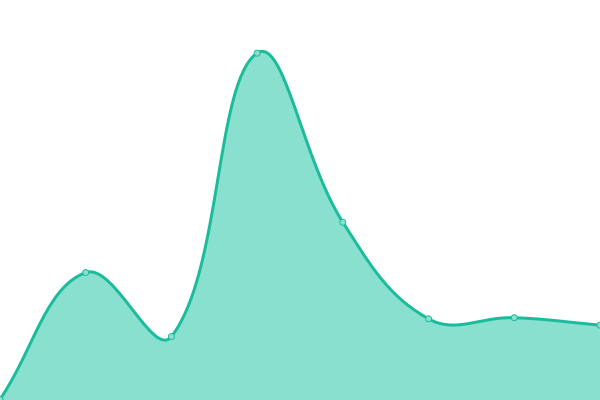 142ms
     
 | 

<a href="https://OsintUK.github.io/Up-or-Down/history/deep-web">100.00%</a>
    

|  [Hack-Life](https://hack-life.net) | 🟩 Up | [hack-life.yml](https://github.com/OsintUK/Up-or-Down/commits/HEAD/history/hack-life.yml) | 

 1464ms
     
 | 

<a href="https://OsintUK.github.io/Up-or-Down/history/hack-life">100.00%</a>
    

|  [FreCombo](https://frecombo.com) | 🟩 Up | [fre-combo.yml](https://github.com/OsintUK/Up-or-Down/commits/HEAD/history/fre-combo.yml) | 

 355ms
     
 | 

<a href="https://OsintUK.github.io/Up-or-Down/history/fre-combo">100.00%</a>
    

|  [Hard-TM](https://hard-tm.su) | 🟩 Up | [hard-tm.yml](https://github.com/OsintUK/Up-or-Down/commits/HEAD/history/hard-tm.yml) | 

 4208ms
     
 | 

<a href="https://OsintUK.github.io/Up-or-Down/history/hard-tm">100.00%</a>
    

|  [Itsobr](https://itsobr.com) | 🟥 Down | [itsobr.yml](https://github.com/OsintUK/Up-or-Down/commits/HEAD/history/itsobr.yml) | 

 94ms
     
 | 

<a href="https://OsintUK.github.io/Up-or-Down/history/itsobr">98.64%</a>
    

|  [Xakers](https://xakers.mybb.ru) | 🟩 Up | [xakers.yml](https://github.com/OsintUK/Up-or-Down/commits/HEAD/history/xakers.yml) | 

 770ms
     
 | 

<a href="https://OsintUK.github.io/Up-or-Down/history/xakers">100.00%</a>
    

|  [Dark2Web](https://dark2web.xyz) | 🟩 Up | [dark2-web.yml](https://github.com/OsintUK/Up-or-Down/commits/HEAD/history/dark2-web.yml) | 

 86ms
     
 | 

<a href="https://OsintUK.github.io/Up-or-Down/history/dark2-web">100.00%</a>
    

|  [Mipped](https://mipped.com) | 🟩 Up | [mipped.yml](https://github.com/OsintUK/Up-or-Down/commits/HEAD/history/mipped.yml) | 

 1172ms
     
 | 

<a href="https://OsintUK.github.io/Up-or-Down/history/mipped">100.00%</a>
    

|  [OpenBullet Store](https://openbullet.store) | 🟩 Up | [open-bullet-store.yml](https://github.com/OsintUK/Up-or-Down/commits/HEAD/history/open-bullet-store.yml) | 

 471ms
     
 | 

<a href="https://OsintUK.github.io/Up-or-Down/history/open-bullet-store">100.00%</a>
    

|  [ComboFre](https://combofre.com) | 🟩 Up | [combo-fre.yml](https://github.com/OsintUK/Up-or-Down/commits/HEAD/history/combo-fre.yml) | 

 772ms
     
 | 

<a href="https://OsintUK.github.io/Up-or-Down/history/combo-fre">100.00%</a>
    

|  [Combo-List](https://combo-list.com) | 🟩 Up | [combo-list.yml](https://github.com/OsintUK/Up-or-Down/commits/HEAD/history/combo-list.yml) | 

 1118ms
     
 | 

<a href="https://OsintUK.github.io/Up-or-Down/history/combo-list">100.00%</a>
    

|  [SoftInfo](https://softinfo.org) | 🟩 Up | [soft-info.yml](https://github.com/OsintUK/Up-or-Down/commits/HEAD/history/soft-info.yml) | 

 176ms
     
 | 

<a href="https://OsintUK.github.io/Up-or-Down/history/soft-info">100.00%</a>
    

|  [z2u](https://z2u.com) | 🟩 Up | [z2u.yml](https://github.com/OsintUK/Up-or-Down/commits/HEAD/history/z2u.yml) | 

 527ms
     
 | 

<a href="https://OsintUK.github.io/Up-or-Down/history/z2u">100.00%</a>
    

|  [Fsecurity](https://fsecurity.org) | 🟩 Up | [fsecurity.yml](https://github.com/OsintUK/Up-or-Down/commits/HEAD/history/fsecurity.yml) | 

 173ms
     
 | 

<a href="https://OsintUK.github.io/Up-or-Down/history/fsecurity">100.00%</a>
    

|  [PegasusHackTeam](https://pegasushackteam.com) | 🟩 Up | [pegasus-hack-team.yml](https://github.com/OsintUK/Up-or-Down/commits/HEAD/history/pegasus-hack-team.yml) | 

 101ms
     
 | 

<a href="https://OsintUK.github.io/Up-or-Down/history/pegasus-hack-team">100.00%</a>
    

|  [Alphazine](https://alphazine.ru) | 🟥 Down | [alphazine.yml](https://github.com/OsintUK/Up-or-Down/commits/HEAD/history/alphazine.yml) | 

 659ms
     
 | 

<a href="https://OsintUK.github.io/Up-or-Down/history/alphazine">92.30%</a>
    

|  [Crooks](https://crooks.biz) | 🟩 Up | [crooks.yml](https://github.com/OsintUK/Up-or-Down/commits/HEAD/history/crooks.yml) | 

 313ms
     
 | 

<a href="https://OsintUK.github.io/Up-or-Down/history/crooks">100.00%</a>
    

|  [HellOfHackers](https://hellofhackers.com) | 🟩 Up | [hell-of-hackers.yml](https://github.com/OsintUK/Up-or-Down/commits/HEAD/history/hell-of-hackers.yml) | 

 662ms
     
 | 

<a href="https://OsintUK.github.io/Up-or-Down/history/hell-of-hackers">100.00%</a>
    

|  [LegitMafia](https://legitmafia.ws) | 🟩 Up | [legit-mafia.yml](https://github.com/OsintUK/Up-or-Down/commits/HEAD/history/legit-mafia.yml) | 

 1131ms
     
 | 

<a href="https://OsintUK.github.io/Up-or-Down/history/legit-mafia">100.00%</a>
    

|  [ScyllaForums](https://scyllaforums.com) | 🟩 Up | [scylla-forums.yml](https://github.com/OsintUK/Up-or-Down/commits/HEAD/history/scylla-forums.yml) | 

 89ms
     
 | 

<a href="https://OsintUK.github.io/Up-or-Down/history/scylla-forums">100.00%</a>
    

|  [TakTakGenerator](https://taktakgenerator.blogspot.com) | 🟩 Up | [tak-tak-generator.yml](https://github.com/OsintUK/Up-or-Down/commits/HEAD/history/tak-tak-generator.yml) | 

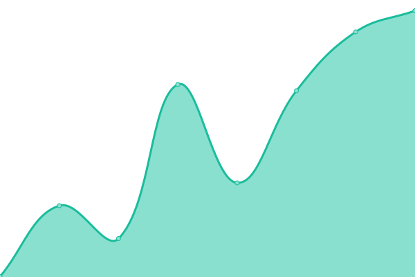 252ms
     
 | 

<a href="https://OsintUK.github.io/Up-or-Down/history/tak-tak-generator">100.00%</a>
    

|  [BlackBones](https://blackbones.net) | 🟩 Up | [black-bones.yml](https://github.com/OsintUK/Up-or-Down/commits/HEAD/history/black-bones.yml) | 

 625ms
     
 | 

<a href="https://OsintUK.github.io/Up-or-Down/history/black-bones">100.00%</a>
    

|  [Carding CX](https://carding.cx) | 🟩 Up | [carding-cx.yml](https://github.com/OsintUK/Up-or-Down/commits/HEAD/history/carding-cx.yml) | 

 565ms
     
 | 

<a href="https://OsintUK.github.io/Up-or-Down/history/carding-cx">100.00%</a>
    

|  [Carding Store](https://carding.store) | 🟩 Up | [carding-store.yml](https://github.com/OsintUK/Up-or-Down/commits/HEAD/history/carding-store.yml) | 

 1268ms
     
 | 

<a href="https://OsintUK.github.io/Up-or-Down/history/carding-store">100.00%</a>
    

|  [CardingCC](https://cardingcc.net) | 🟩 Up | [carding-cc.yml](https://github.com/OsintUK/Up-or-Down/commits/HEAD/history/carding-cc.yml) | 

 260ms
     
 | 

<a href="https://OsintUK.github.io/Up-or-Down/history/carding-cc">100.00%</a>
    

|  [CardingForum](https://cardingforum.cx) | 🟩 Up | [carding-forum.yml](https://github.com/OsintUK/Up-or-Down/commits/HEAD/history/carding-forum.yml) | 

 1689ms
     
 | 

<a href="https://OsintUK.github.io/Up-or-Down/history/carding-forum">100.00%</a>
    

|  [Carding Legendz](https://cardinglegendz.com) | 🟩 Up | [carding-legendz.yml](https://github.com/OsintUK/Up-or-Down/commits/HEAD/history/carding-legendz.yml) | 

 374ms
     
 | 

<a href="https://OsintUK.github.io/Up-or-Down/history/carding-legendz">100.00%</a>
    

|  [Carding-Shop](https://carding-shop.net) | 🟩 Up | [carding-shop.yml](https://github.com/OsintUK/Up-or-Down/commits/HEAD/history/carding-shop.yml) | 

 966ms
     
 | 

<a href="https://OsintUK.github.io/Up-or-Down/history/carding-shop">100.00%</a>
    

|  [CardingStore](https://cardingstore.com) | 🟩 Up | [carding-store.yml](https://github.com/OsintUK/Up-or-Down/commits/HEAD/history/carding-store.yml) | 

 1268ms
     
 | 

<a href="https://OsintUK.github.io/Up-or-Down/history/carding-store">100.00%</a>
    

|  [CardMafia](https://cardmafia.cc) | 🟩 Up | [card-mafia.yml](https://github.com/OsintUK/Up-or-Down/commits/HEAD/history/card-mafia.yml) | 

 865ms
     
 | 

<a href="https://OsintUK.github.io/Up-or-Down/history/card-mafia">100.00%</a>
    

|  [CashOutArea](https://cashoutarea.net) | 🟩 Up | [cash-out-area.yml](https://github.com/OsintUK/Up-or-Down/commits/HEAD/history/cash-out-area.yml) | 

 3077ms
     
 | 

<a href="https://OsintUK.github.io/Up-or-Down/history/cash-out-area">100.00%</a>
    

|  [ComboForum](https://comboforum.com) | 🟨 Degraded | [combo-forum.yml](https://github.com/OsintUK/Up-or-Down/commits/HEAD/history/combo-forum.yml) | 

 4352ms
     
 | 

<a href="https://OsintUK.github.io/Up-or-Down/history/combo-forum">76.56%</a>
    

|  [CrackingDrift](https://crackingdrift.to) | 🟩 Up | [cracking-drift.yml](https://github.com/OsintUK/Up-or-Down/commits/HEAD/history/cracking-drift.yml) | 

 2407ms
     
 | 

<a href="https://OsintUK.github.io/Up-or-Down/history/cracking-drift">100.00%</a>
    

|  [CrdForum](https://crdforum.cc) | 🟩 Up | [crd-forum.yml](https://github.com/OsintUK/Up-or-Down/commits/HEAD/history/crd-forum.yml) | 

 1162ms
     
 | 

<a href="https://OsintUK.github.io/Up-or-Down/history/crd-forum">100.00%</a>
    

|  [CVVShop](https://cvvshop.to) | 🟩 Up | [cvv-shop.yml](https://github.com/OsintUK/Up-or-Down/commits/HEAD/history/cvv-shop.yml) | 

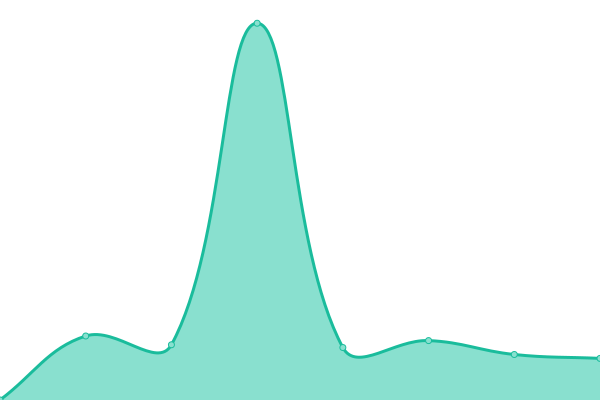 3867ms
     
 | 

<a href="https://OsintUK.github.io/Up-or-Down/history/cvv-shop">100.00%</a>
    

|  [DumpsBuy](https://dumpsbuy.su) | 🟩 Up | [dumps-buy.yml](https://github.com/OsintUK/Up-or-Down/commits/HEAD/history/dumps-buy.yml) | 

 5913ms
     
 | 

<a href="https://OsintUK.github.io/Up-or-Down/history/dumps-buy">100.00%</a>
    

|  [Hacxx](https://hacxx.ys.tj) | 🟩 Up | [hacxx.yml](https://github.com/OsintUK/Up-or-Down/commits/HEAD/history/hacxx.yml) | 

 3484ms
     
 | 

<a href="https://OsintUK.github.io/Up-or-Down/history/hacxx">100.00%</a>
    

|  [IhaxGlobal](https://ihaxglobal.com) | 🟩 Up | [ihax-global.yml](https://github.com/OsintUK/Up-or-Down/commits/HEAD/history/ihax-global.yml) | 

 763ms
     
 | 

<a href="https://OsintUK.github.io/Up-or-Down/history/ihax-global">100.00%</a>
    

|  [Instant-Hack](https://instant-hack.to) | 🟩 Up | [instant-hack.yml](https://github.com/OsintUK/Up-or-Down/commits/HEAD/history/instant-hack.yml) | 

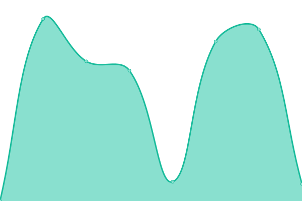 490ms
     
 | 

<a href="https://OsintUK.github.io/Up-or-Down/history/instant-hack">100.00%</a>
    

|  [PlayerUP](https://playerup.com) | 🟥 Down | [player-up.yml](https://github.com/OsintUK/Up-or-Down/commits/HEAD/history/player-up.yml) | 

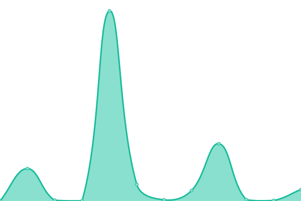 6197ms
     
 | 

<a href="https://OsintUK.github.io/Up-or-Down/history/player-up">57.22%</a>
    

|  [ShadowCarders](https://shadowcarders.com) | 🟩 Up | [shadow-carders.yml](https://github.com/OsintUK/Up-or-Down/commits/HEAD/history/shadow-carders.yml) | 

 1281ms
     
 | 

<a href="https://OsintUK.github.io/Up-or-Down/history/shadow-carders">100.00%</a>
    

|  [ValidMarket](https://validmarket.io) | 🟩 Up | [valid-market.yml](https://github.com/OsintUK/Up-or-Down/commits/HEAD/history/valid-market.yml) | 

 718ms
     
 | 

<a href="https://OsintUK.github.io/Up-or-Down/history/valid-market">100.00%</a>
    

|  [365psd](https://365psd.com) | 🟩 Up | [365psd.yml](https://github.com/OsintUK/Up-or-Down/commits/HEAD/history/365psd.yml) | 

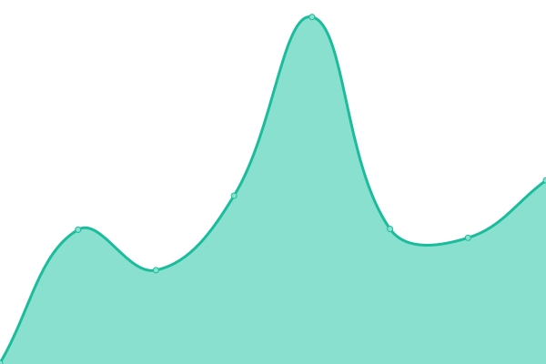 207ms
     
 | 

<a href="https://OsintUK.github.io/Up-or-Down/history/365psd">100.00%</a>
    

|  [AllPsdTemplates](https://allpsdtemplates.com) | 🟩 Up | [all-psd-templates.yml](https://github.com/OsintUK/Up-or-Down/commits/HEAD/history/all-psd-templates.yml) | 

 3127ms
     
 | 

<a href="https://OsintUK.github.io/Up-or-Down/history/all-psd-templates">100.00%</a>
    

|  [Best-Hack](https://best-hack.net) | 🟩 Up | [best-hack.yml](https://github.com/OsintUK/Up-or-Down/commits/HEAD/history/best-hack.yml) | 

 90ms
     
 | 

<a href="https://OsintUK.github.io/Up-or-Down/history/best-hack">100.00%</a>
    

|  [HovaTools](https://hovatools.com) | 🟩 Up | [hova-tools.yml](https://github.com/OsintUK/Up-or-Down/commits/HEAD/history/hova-tools.yml) | 

 1888ms
     
 | 

<a href="https://OsintUK.github.io/Up-or-Down/history/hova-tools">100.00%</a>
    

|  [Carders Biz](https://carders.biz) | 🟩 Up | [carders-biz.yml](https://github.com/OsintUK/Up-or-Down/commits/HEAD/history/carders-biz.yml) | 

 1121ms
     
 | 

<a href="https://OsintUK.github.io/Up-or-Down/history/carders-biz">100.00%</a>
    

|  [Carders MX](https://carders.mx) | 🟩 Up | [carders-mx.yml](https://github.com/OsintUK/Up-or-Down/commits/HEAD/history/carders-mx.yml) | 

 1259ms
     
 | 

<a href="https://OsintUK.github.io/Up-or-Down/history/carders-mx">93.68%</a>
    

|  [CardingTeam](https://cardingteam.ru) | 🟩 Up | [carding-team.yml](https://github.com/OsintUK/Up-or-Down/commits/HEAD/history/carding-team.yml) | 

 573ms
     
 | 

<a href="https://OsintUK.github.io/Up-or-Down/history/carding-team">100.00%</a>
    

|  [CardVilla](https://cardvilla.cc) | 🟩 Up | [card-villa.yml](https://github.com/OsintUK/Up-or-Down/commits/HEAD/history/card-villa.yml) | 

 814ms
     
 | 

<a href="https://OsintUK.github.io/Up-or-Down/history/card-villa">100.00%</a>
    

|  [ClipArt](https://clipart.me) | 🟩 Up | [clip-art.yml](https://github.com/OsintUK/Up-or-Down/commits/HEAD/history/clip-art.yml) | 

 301ms
     
 | 

<a href="https://OsintUK.github.io/Up-or-Down/history/clip-art">100.00%</a>
    

|  [ClubHydra](https://clubhydra.co) | 🟩 Up | [club-hydra.yml](https://github.com/OsintUK/Up-or-Down/commits/HEAD/history/club-hydra.yml) | 

 210ms
     
 | 

<a href="https://OsintUK.github.io/Up-or-Down/history/club-hydra">100.00%</a>
    

|  [CrackingShare](https://crackingshare.com) | 🟩 Up | [cracking-share.yml](https://github.com/OsintUK/Up-or-Down/commits/HEAD/history/cracking-share.yml) | 

 1507ms
     
 | 

<a href="https://OsintUK.github.io/Up-or-Down/history/cracking-share">100.00%</a>
    

|  [CrackingSoul](https://crackingsoul.com/index.php) | 🟩 Up | [cracking-soul.yml](https://github.com/OsintUK/Up-or-Down/commits/HEAD/history/cracking-soul.yml) | 

 1776ms
     
 | 

<a href="https://OsintUK.github.io/Up-or-Down/history/cracking-soul">100.00%</a>
    

|  [CrackX](https://crackx.to) | 🟩 Up | [crack-x.yml](https://github.com/OsintUK/Up-or-Down/commits/HEAD/history/crack-x.yml) | 

 2394ms
     
 | 

<a href="https://OsintUK.github.io/Up-or-Down/history/crack-x">72.78%</a>
    

|  [CrdPro](https://crdpro.cc) | 🟩 Up | [crd-pro.yml](https://github.com/OsintUK/Up-or-Down/commits/HEAD/history/crd-pro.yml) | 

 521ms
     
 | 

<a href="https://OsintUK.github.io/Up-or-Down/history/crd-pro">100.00%</a>
    

|  [CrimeMarket](https://crimemarket.is) | 🟩 Up | [crime-market.yml](https://github.com/OsintUK/Up-or-Down/commits/HEAD/history/crime-market.yml) | 

 938ms
     
 | 

<a href="https://OsintUK.github.io/Up-or-Down/history/crime-market">100.00%</a>
    

|  [DarkStash](https://darkstash.com) | 🟩 Up | [dark-stash.yml](https://github.com/OsintUK/Up-or-Down/commits/HEAD/history/dark-stash.yml) | 

 758ms
     
 | 

<a href="https://OsintUK.github.io/Up-or-Down/history/dark-stash">100.00%</a>
    

|  [DarkWebMafias](https://darkwebmafias.com) | 🟩 Up | [dark-web-mafias.yml](https://github.com/OsintUK/Up-or-Down/commits/HEAD/history/dark-web-mafias.yml) | 

 927ms
     
 | 

<a href="https://OsintUK.github.io/Up-or-Down/history/dark-web-mafias">100.00%</a>
    

|  [Dfgames](http://dfgames.com.br) | 🟩 Up | [dfgames.yml](https://github.com/OsintUK/Up-or-Down/commits/HEAD/history/dfgames.yml) | 

 1833ms
     
 | 

<a href="https://OsintUK.github.io/Up-or-Down/history/dfgames">100.00%</a>
    

|  [FakeIDpsd](https://fakeidpsd.org) | 🟩 Up | [fake-i-dpsd.yml](https://github.com/OsintUK/Up-or-Down/commits/HEAD/history/fake-i-dpsd.yml) | 

 538ms
     
 | 

<a href="https://OsintUK.github.io/Up-or-Down/history/fake-i-dpsd">100.00%</a>
    

|  [FakeTemplate](https://faketemplate.ru) | 🟩 Up | [fake-template.yml](https://github.com/OsintUK/Up-or-Down/commits/HEAD/history/fake-template.yml) | 

 6288ms
     
 | 

<a href="https://OsintUK.github.io/Up-or-Down/history/fake-template">100.00%</a>
    

|  [FreePik](https://freepik.com) | 🟩 Up | [free-pik.yml](https://github.com/OsintUK/Up-or-Down/commits/HEAD/history/free-pik.yml) | 

 265ms
     
 | 

<a href="https://OsintUK.github.io/Up-or-Down/history/free-pik">100.00%</a>
    

|  [FreshStuff88](https://freshstuff88.com) | 🟩 Up | [fresh-stuff88.yml](https://github.com/OsintUK/Up-or-Down/commits/HEAD/history/fresh-stuff88.yml) | 

 2096ms
     
 | 

<a href="https://OsintUK.github.io/Up-or-Down/history/fresh-stuff88">100.00%</a>
    

|  [GamingForum](https://gamingforum.to) | 🟩 Up | [gaming-forum.yml](https://github.com/OsintUK/Up-or-Down/commits/HEAD/history/gaming-forum.yml) | 

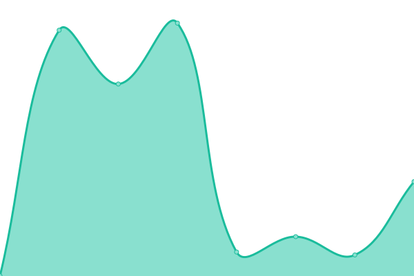 1443ms
     
 | 

<a href="https://OsintUK.github.io/Up-or-Down/history/gaming-forum">100.00%</a>
    

|  [HackingFather](https://hackingfather.com) | 🟩 Up | [hacking-father.yml](https://github.com/OsintUK/Up-or-Down/commits/HEAD/history/hacking-father.yml) | 

 99ms
     
 | 

<a href="https://OsintUK.github.io/Up-or-Down/history/hacking-father">100.00%</a>
    

|  [HakePok](http://hakepok.ru) | 🟩 Up | [hake-pok.yml](https://github.com/OsintUK/Up-or-Down/commits/HEAD/history/hake-pok.yml) | 

 2333ms
     
 | 

<a href="https://OsintUK.github.io/Up-or-Down/history/hake-pok">93.59%</a>
    

|  [HowCC](https://howcc.to) | 🟩 Up | [how-cc.yml](https://github.com/OsintUK/Up-or-Down/commits/HEAD/history/how-cc.yml) | 

 2279ms
     
 | 

<a href="https://OsintUK.github.io/Up-or-Down/history/how-cc">100.00%</a>
    

|  [Jstash](https://jstash.to) | 🟩 Up | [jstash.yml](https://github.com/OsintUK/Up-or-Down/commits/HEAD/history/jstash.yml) | 

 4090ms
     
 | 

<a href="https://OsintUK.github.io/Up-or-Down/history/jstash">100.00%</a>
    

|  [LeakBD](https://leakbd.com) | 🟩 Up | [leak-bd.yml](https://github.com/OsintUK/Up-or-Down/commits/HEAD/history/leak-bd.yml) | 

 377ms
     
 | 

<a href="https://OsintUK.github.io/Up-or-Down/history/leak-bd">100.00%</a>
    

|  [MPGH](https://mpgh.net) | 🟩 Up | [mpgh.yml](https://github.com/OsintUK/Up-or-Down/commits/HEAD/history/mpgh.yml) | 

 1469ms
     
 | 

<a href="https://OsintUK.github.io/Up-or-Down/history/mpgh">100.00%</a>
    

|  [NulledGG](https://nulledgg.com) | 🟥 Down | [nulled-gg.yml](https://github.com/OsintUK/Up-or-Down/commits/HEAD/history/nulled-gg.yml) | 

 0ms
     
 | 

<a href="https://OsintUK.github.io/Up-or-Down/history/nulled-gg">0.00%</a>
    

|  [NullNoss](https://nullnoss.org) | 🟩 Up | [null-noss.yml](https://github.com/OsintUK/Up-or-Down/commits/HEAD/history/null-noss.yml) | 

 806ms
     
 | 

<a href="https://OsintUK.github.io/Up-or-Down/history/null-noss">100.00%</a>
    

|  [Eground](https://eground.pro) | 🟩 Up | [eground.yml](https://github.com/OsintUK/Up-or-Down/commits/HEAD/history/eground.yml) | 

 1711ms
     
 | 

<a href="https://OsintUK.github.io/Up-or-Down/history/eground">100.00%</a>
    

|  [Psdlife](https://psdlife.com) | 🟩 Up | [psdlife.yml](https://github.com/OsintUK/Up-or-Down/commits/HEAD/history/psdlife.yml) | 

 97ms
     
 | 

<a href="https://OsintUK.github.io/Up-or-Down/history/psdlife">100.00%</a>
    

|  [SpyGen](https://spy.gen.tr) | 🟩 Up | [spy-gen.yml](https://github.com/OsintUK/Up-or-Down/commits/HEAD/history/spy-gen.yml) | 

 2695ms
     
 | 

<a href="https://OsintUK.github.io/Up-or-Down/history/spy-gen">100.00%</a>
    

|  [Sythe](https://sythe.org) | 🟩 Up | [sythe.yml](https://github.com/OsintUK/Up-or-Down/commits/HEAD/history/sythe.yml) | 

 9759ms
     
 | 

<a href="https://OsintUK.github.io/Up-or-Down/history/sythe">100.00%</a>
    

|  [TeamWorld](https://teamworld.us) | 🟩 Up | [team-world.yml](https://github.com/OsintUK/Up-or-Down/commits/HEAD/history/team-world.yml) | 

 78ms
     
 | 

<a href="https://OsintUK.github.io/Up-or-Down/history/team-world">100.00%</a>
    

|  [UsaM](https://usam.xyz) | 🟩 Up | [usa-m.yml](https://github.com/OsintUK/Up-or-Down/commits/HEAD/history/usa-m.yml) | 

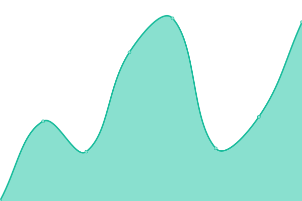 456ms
     
 | 

<a href="https://OsintUK.github.io/Up-or-Down/history/usa-m">100.00%</a>
    

|  [VerifiedShops](https://verifiedshops.cc) | 🟩 Up | [verified-shops.yml](https://github.com/OsintUK/Up-or-Down/commits/HEAD/history/verified-shops.yml) | 

 1147ms
     
 | 

<a href="https://OsintUK.github.io/Up-or-Down/history/verified-shops">100.00%</a>
    

|  [VerifPro](https://verifpro.net) | 🟩 Up | [verif-pro.yml](https://github.com/OsintUK/Up-or-Down/commits/HEAD/history/verif-pro.yml) | 

 835ms
     
 | 

<a href="https://OsintUK.github.io/Up-or-Down/history/verif-pro">100.00%</a>
    

|  [Void](https://void.to) | 🟩 Up | [void.yml](https://github.com/OsintUK/Up-or-Down/commits/HEAD/history/void.yml) | 

 927ms
     
 | 

<a href="https://OsintUK.github.io/Up-or-Down/history/void">100.00%</a>
    

|  [LeakedWiki](https://leaked.wiki) | 🟩 Up | [leaked-wiki.yml](https://github.com/OsintUK/Up-or-Down/commits/HEAD/history/leaked-wiki.yml) | 

 326ms
     
 | 

<a href="https://OsintUK.github.io/Up-or-Down/history/leaked-wiki">100.00%</a>
    

|  [ComboList](https://combolist.top) | 🟩 Up | [combo-list.yml](https://github.com/OsintUK/Up-or-Down/commits/HEAD/history/combo-list.yml) | 

 1118ms
     
 | 

<a href="https://OsintUK.github.io/Up-or-Down/history/combo-list">100.00%</a>
    

|  [AccountBot](https://accountbot.io) | 🟩 Up | [account-bot.yml](https://github.com/OsintUK/Up-or-Down/commits/HEAD/history/account-bot.yml) | 

 439ms
     
 | 

<a href="https://OsintUK.github.io/Up-or-Down/history/account-bot">100.00%</a>
    

|  [CpPro](https://cpro.su) | 🟥 Down | [cp-pro.yml](https://github.com/OsintUK/Up-or-Down/commits/HEAD/history/cp-pro.yml) | 

 0ms
     
 | 

<a href="https://OsintUK.github.io/Up-or-Down/history/cp-pro">0.00%</a>
    

|  [Cv2](https://cv2.su) | 🟩 Up | [cv2.yml](https://github.com/OsintUK/Up-or-Down/commits/HEAD/history/cv2.yml) | 

 716ms
     
 | 

<a href="https://OsintUK.github.io/Up-or-Down/history/cv2">93.58%</a>
    

|  [CvvFullzShop](https://cvvfullzshop.com) | 🟩 Up | [cvv-fullz-shop.yml](https://github.com/OsintUK/Up-or-Down/commits/HEAD/history/cvv-fullz-shop.yml) | 

 541ms
     
 | 

<a href="https://OsintUK.github.io/Up-or-Down/history/cvv-fullz-shop">85.71%</a>
    

|  [CvvStore](https://cvvstore.cc) | 🟩 Up | [cvv-store.yml](https://github.com/OsintUK/Up-or-Down/commits/HEAD/history/cvv-store.yml) | 

 370ms
     
 | 

<a href="https://OsintUK.github.io/Up-or-Down/history/cvv-store">100.00%</a>
    

|  [CyberShafarat](https://cybershafarat.com) | 🟩 Up | [cyber-shafarat.yml](https://github.com/OsintUK/Up-or-Down/commits/HEAD/history/cyber-shafarat.yml) | 

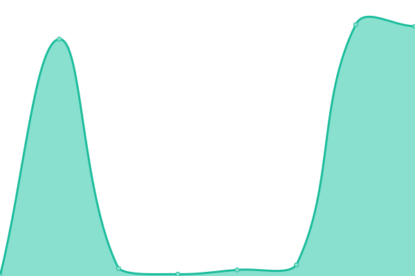 12409ms
     
 | 

<a href="https://OsintUK.github.io/Up-or-Down/history/cyber-shafarat">100.00%</a>
    

|  [EasyDeals](https://easydeals.cx) | 🟩 Up | [easy-deals.yml](https://github.com/OsintUK/Up-or-Down/commits/HEAD/history/easy-deals.yml) | 

 556ms
     
 | 

<a href="https://OsintUK.github.io/Up-or-Down/history/easy-deals">100.00%</a>
    

|  [ForumHashkiller](https://forum.hashkiller.io) | 🟩 Up | [forum-hashkiller.yml](https://github.com/OsintUK/Up-or-Down/commits/HEAD/history/forum-hashkiller.yml) | 

 90ms
     
 | 

<a href="https://OsintUK.github.io/Up-or-Down/history/forum-hashkiller">100.00%</a>
    

|  [LegitDumps](https://legitdumps.cc) | 🟩 Up | [legit-dumps.yml](https://github.com/OsintUK/Up-or-Down/commits/HEAD/history/legit-dumps.yml) | 

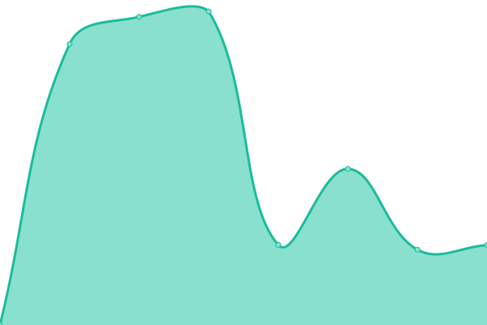 2594ms
     
 | 

<a href="https://OsintUK.github.io/Up-or-Down/history/legit-dumps">100.00%</a>
    

|  [Luxecc](https://luxecc.su) | 🟥 Down | [luxecc.yml](https://github.com/OsintUK/Up-or-Down/commits/HEAD/history/luxecc.yml) | 

 497ms
     
 | 

<a href="https://OsintUK.github.io/Up-or-Down/history/luxecc">49.37%</a>
    

|  [Pp24](https://pp24.market) | 🟩 Up | [pp24.yml](https://github.com/OsintUK/Up-or-Down/commits/HEAD/history/pp24.yml) | 

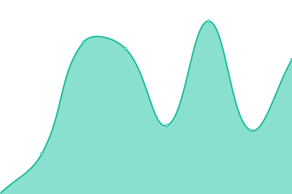 268ms
     
 | 

<a href="https://OsintUK.github.io/Up-or-Down/history/pp24">100.00%</a>
    

|  [RealAndRare](https://realandrare.store) | 🟩 Up | [real-and-rare.yml](https://github.com/OsintUK/Up-or-Down/commits/HEAD/history/real-and-rare.yml) | 

 112ms
     
 | 

<a href="https://OsintUK.github.io/Up-or-Down/history/real-and-rare">100.00%</a>
    

|  [RoboCheck](https://robocheck.ru) | 🟩 Up | [robo-check.yml](https://github.com/OsintUK/Up-or-Down/commits/HEAD/history/robo-check.yml) | 

 2251ms
     
 | 

<a href="https://OsintUK.github.io/Up-or-Down/history/robo-check">100.00%</a>
    

|  [RondaStore](https://rondastore.vip) | 🟩 Up | [ronda-store.yml](https://github.com/OsintUK/Up-or-Down/commits/HEAD/history/ronda-store.yml) | 

 890ms
     
 | 

<a href="https://OsintUK.github.io/Up-or-Down/history/ronda-store">100.00%</a>
    

|  [SkyNetZone](https://skynetzone.org) | 🟩 Up | [sky-net-zone.yml](https://github.com/OsintUK/Up-or-Down/commits/HEAD/history/sky-net-zone.yml) | 

 155ms
     
 | 

<a href="https://OsintUK.github.io/Up-or-Down/history/sky-net-zone">100.00%</a>
    

|  [SwipeStore](https://swipestore.cc) | 🟩 Up | [swipe-store.yml](https://github.com/OsintUK/Up-or-Down/commits/HEAD/history/swipe-store.yml) | 

 702ms
     
 | 

<a href="https://OsintUK.github.io/Up-or-Down/history/swipe-store">100.00%</a>
    

|  [Telegram Card1ngPlanet](https://t.me/card1ngPlanet) | 🟩 Up | [telegram-card1ng-planet.yml](https://github.com/OsintUK/Up-or-Down/commits/HEAD/history/telegram-card1ng-planet.yml) | 

 439ms
     
 | 

<a href="https://OsintUK.github.io/Up-or-Down/history/telegram-card1ng-planet">100.00%</a>
    

|  [Telegram Cardinggclub](https://t.me/s/cardinggclub-Telegram) | 🟩 Up | [telegram-cardinggclub.yml](https://github.com/OsintUK/Up-or-Down/commits/HEAD/history/telegram-cardinggclub.yml) | 

 733ms
     
 | 

<a href="https://OsintUK.github.io/Up-or-Down/history/telegram-cardinggclub">100.00%</a>
    

|  [Telegram Freshstuff_88](https://t.me/s/freshstuff_88) | 🟩 Up | [telegram-freshstuff-88.yml](https://github.com/OsintUK/Up-or-Down/commits/HEAD/history/telegram-freshstuff-88.yml) | 

 234ms
     
 | 

<a href="https://OsintUK.github.io/Up-or-Down/history/telegram-freshstuff-88">100.00%</a>
    

|  [TheFreshStuff](https://thefreshstuff.at) | 🟩 Up | [the-fresh-stuff.yml](https://github.com/OsintUK/Up-or-Down/commits/HEAD/history/the-fresh-stuff.yml) | 

 503ms
     
 | 

<a href="https://OsintUK.github.io/Up-or-Down/history/the-fresh-stuff">100.00%</a>
    

|  [TheJavaSea](https://thejavasea.com) | 🟩 Up | [the-java-sea.yml](https://github.com/OsintUK/Up-or-Down/commits/HEAD/history/the-java-sea.yml) | 

 726ms
     
 | 

<a href="https://OsintUK.github.io/Up-or-Down/history/the-java-sea">100.00%</a>
    

|  [Trumps-Dumps](https://trumps-dumps.net) | 🟥 Down | [trumps-dumps.yml](https://github.com/OsintUK/Up-or-Down/commits/HEAD/history/trumps-dumps.yml) | 

 0ms
     
 | 

<a href="https://OsintUK.github.io/Up-or-Down/history/trumps-dumps">100.00%</a>
    

|  [UniBlast](https://uniblast.com) | 🟥 Down | [uni-blast.yml](https://github.com/OsintUK/Up-or-Down/commits/HEAD/history/uni-blast.yml) | 

 0ms
     
 | 

<a href="https://OsintUK.github.io/Up-or-Down/history/uni-blast">100.00%</a>
    

|  [ValidDumps](https://validumps.cc) | 🟥 Down | [valid-dumps.yml](https://github.com/OsintUK/Up-or-Down/commits/HEAD/history/valid-dumps.yml) | 

 0ms
     
 | 

<a href="https://OsintUK.github.io/Up-or-Down/history/valid-dumps">100.00%</a>
    

|  [Vclub Store](https://vclub.store) | 🟥 Down | [vclub-store.yml](https://github.com/OsintUK/Up-or-Down/commits/HEAD/history/vclub-store.yml) | 

 0ms
     
 | 

<a href="https://OsintUK.github.io/Up-or-Down/history/vclub-store">100.00%</a>
    

|  [VclubShop](https://vclubshop.ru) | 🟥 Down | [vclub-shop.yml](https://github.com/OsintUK/Up-or-Down/commits/HEAD/history/vclub-shop.yml) | 

 0ms
     
 | 

<a href="https://OsintUK.github.io/Up-or-Down/history/vclub-shop">100.00%</a>
    

|  [VoughtCardShop](https://voughtcardshop.online) | 🟩 Up | [vought-card-shop.yml](https://github.com/OsintUK/Up-or-Down/commits/HEAD/history/vought-card-shop.yml) | 

 170ms
     
 | 

<a href="https://OsintUK.github.io/Up-or-Down/history/vought-card-shop">100.00%</a>
    

|  [Yalelodge](https://yalelodge.cc) | 🟩 Up | [yalelodge.yml](https://github.com/OsintUK/Up-or-Down/commits/HEAD/history/yalelodge.yml) | 

 93ms
     
 | 

<a href="https://OsintUK.github.io/Up-or-Down/history/yalelodge">100.00%</a>
    

<!--end: status pages-->

[**Visit our status website →**](https://OsintUK.github.io/Up-or-Down)

## 📄 License

- Powered by: [Upptime](https://github.com/upptime/upptime)
- Code: [MIT](./LICENSE) © [OsintUK](https://OsintUK.github.io/Up-or-Down)
- Data in the `./history` directory: [Open Database License](https://opendatacommons.org/licenses/odbl/1-0/)
