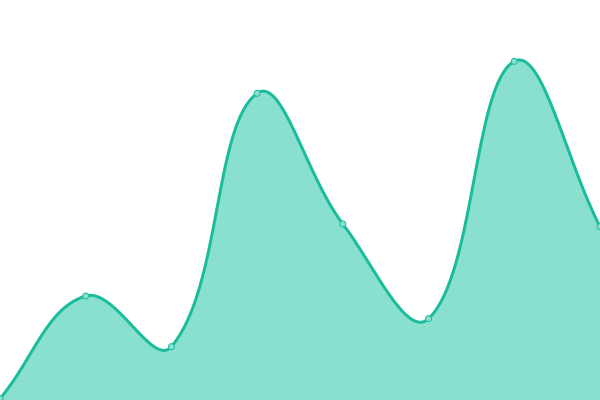

# [📈 Live Status](https://OsintUK.github.io/Up-or-Down): <!--live status--> **🟧 Partial outage**

This repository contains the open-source uptime monitor and status page for [OsintUK](https://OsintUK.github.io/Up-or-Down), powered by [Upptime](https://github.com/upptime/upptime).

With [Upptime](https://upptime.js.org), you can get your own unlimited and free uptime monitor and status page, powered entirely by a GitHub repository. We use [Issues](https://github.com/OsintUK/Up-or-Down/issues) as incident reports, [Actions](https://github.com/OsintUK/Up-or-Down/actions) as uptime monitors, and [Pages](https://OsintUK.github.io/Up-or-Down) for the status page.

<!--start: status pages-->
<!-- This summary is generated by Upptime (https://github.com/upptime/upptime) -->
<!-- Do not edit this manually, your changes will be overwritten -->
<!-- prettier-ignore -->
| URL | Status | History | Response Time | Uptime |
| --- | ------ | ------- | ------------- | ------ |
|  [Nulled](https://nulled.to) | 🟥 Down | [nulled.yml](https://github.com/OsintUK/Up-or-Down/commits/HEAD/history/nulled.yml) | 

 862ms
     
 | 

<a href="https://OsintUK.github.io/Up-or-Down/history/nulled">73.57%</a>
    

|  [Amauta](https://amauta.cc) | 🟥 Down | [amauta.yml](https://github.com/OsintUK/Up-or-Down/commits/HEAD/history/amauta.yml) | 

 3298ms
     
 | 

<a href="https://OsintUK.github.io/Up-or-Down/history/amauta">55.46%</a>
    

|  [Cracked](https://cracked.io) | 🟩 Up | [cracked.yml](https://github.com/OsintUK/Up-or-Down/commits/HEAD/history/cracked.yml) | 

 1035ms
     
 | 

<a href="https://OsintUK.github.io/Up-or-Down/history/cracked">93.38%</a>
    

|  [Sinister](https://sinister.ly) | 🟩 Up | [sinister.yml](https://github.com/OsintUK/Up-or-Down/commits/HEAD/history/sinister.yml) | 

 1462ms
     
 | 

<a href="https://OsintUK.github.io/Up-or-Down/history/sinister">82.26%</a>
    

|  [Bhf](https://bhf.im) | 🟩 Up | [bhf.yml](https://github.com/OsintUK/Up-or-Down/commits/HEAD/history/bhf.yml) | 

 1825ms
     
 | 

<a href="https://OsintUK.github.io/Up-or-Down/history/bhf">100.00%</a>
    

|  [ChitaChok](https://chitachok.fun) | 🟩 Up | [chita-chok.yml](https://github.com/OsintUK/Up-or-Down/commits/HEAD/history/chita-chok.yml) | 

 2160ms
     
 | 

<a href="https://OsintUK.github.io/Up-or-Down/history/chita-chok">100.00%</a>
    

|  [CrackingItaly](https://crackingitaly.to) | 🟩 Up | [cracking-italy.yml](https://github.com/OsintUK/Up-or-Down/commits/HEAD/history/cracking-italy.yml) | 

 2852ms
     
 | 

<a href="https://OsintUK.github.io/Up-or-Down/history/cracking-italy">100.00%</a>
    

|  [Patched](https://patched.to) | 🟥 Down | [patched.yml](https://github.com/OsintUK/Up-or-Down/commits/HEAD/history/patched.yml) | 

 179ms
     
 | 

<a href="https://OsintUK.github.io/Up-or-Down/history/patched">62.65%</a>
    

|  [CrdClub](https://crdclub.su) | 🟩 Up | [crd-club.yml](https://github.com/OsintUK/Up-or-Down/commits/HEAD/history/crd-club.yml) | 

 2370ms
     
 | 

<a href="https://OsintUK.github.io/Up-or-Down/history/crd-club">100.00%</a>
    

|  [Nohide](https://nohide.space) | 🟥 Down | [nohide.yml](https://github.com/OsintUK/Up-or-Down/commits/HEAD/history/nohide.yml) | 

 199ms
     
 | 

<a href="https://OsintUK.github.io/Up-or-Down/history/nohide">68.78%</a>
    

|  [DarkNetWeb](https://darknetweb.ru) | 🟩 Up | [dark-net-web.yml](https://github.com/OsintUK/Up-or-Down/commits/HEAD/history/dark-net-web.yml) | 

 1917ms
     
 | 

<a href="https://OsintUK.github.io/Up-or-Down/history/dark-net-web">100.00%</a>
    

|  [CCCCC](https://ccccc.sb) | 🟩 Up | [ccccc.yml](https://github.com/OsintUK/Up-or-Down/commits/HEAD/history/ccccc.yml) | 

 11740ms
     
 | 

<a href="https://OsintUK.github.io/Up-or-Down/history/ccccc">100.00%</a>
    

|  [Moon](https://moon.sb) | 🟥 Down | [moon.yml](https://github.com/OsintUK/Up-or-Down/commits/HEAD/history/moon.yml) | 

 0ms
     
 | 

<a href="https://OsintUK.github.io/Up-or-Down/history/moon">68.82%</a>
    

|  [Cracking](https://cracking.org) | 🟥 Down | [cracking.yml](https://github.com/OsintUK/Up-or-Down/commits/HEAD/history/cracking.yml) | 

 158ms
     
 | 

<a href="https://OsintUK.github.io/Up-or-Down/history/cracking">68.83%</a>
    

|  [Shellix](https://shellix.xyz) | 🟩 Up | [shellix.yml](https://github.com/OsintUK/Up-or-Down/commits/HEAD/history/shellix.yml) | 

 289ms
     
 | 

<a href="https://OsintUK.github.io/Up-or-Down/history/shellix">100.00%</a>
    

|  [Cracked.sx](https://cracked.sx) | 🟩 Up | [cracked-sx.yml](https://github.com/OsintUK/Up-or-Down/commits/HEAD/history/cracked-sx.yml) | 

 1437ms
     
 | 

<a href="https://OsintUK.github.io/Up-or-Down/history/cracked-sx">100.00%</a>
    

|  [Crackia](https://crackia.com) | 🟥 Down | [crackia.yml](https://github.com/OsintUK/Up-or-Down/commits/HEAD/history/crackia.yml) | 

 93ms
     
 | 

<a href="https://OsintUK.github.io/Up-or-Down/history/crackia">68.84%</a>
    

|  [NulledBB](https://nulledbb.com) | 🟩 Up | [nulled-bb.yml](https://github.com/OsintUK/Up-or-Down/commits/HEAD/history/nulled-bb.yml) | 

 1343ms
     
 | 

<a href="https://OsintUK.github.io/Up-or-Down/history/nulled-bb">100.00%</a>
    

|  [Pastebin](https://pastebin.com) | 🟩 Up | [pastebin.yml](https://github.com/OsintUK/Up-or-Down/commits/HEAD/history/pastebin.yml) | 

 440ms
     
 | 

<a href="https://OsintUK.github.io/Up-or-Down/history/pastebin">86.15%</a>
    

|  [FssQuad](https://fssquad.com) | 🟩 Up | [fss-quad.yml](https://github.com/OsintUK/Up-or-Down/commits/HEAD/history/fss-quad.yml) | 

 1111ms
     
 | 

<a href="https://OsintUK.github.io/Up-or-Down/history/fss-quad">100.00%</a>
    

|  [UfoLabs](https://ufolabs.net) | 🟩 Up | [ufo-labs.yml](https://github.com/OsintUK/Up-or-Down/commits/HEAD/history/ufo-labs.yml) | 

 666ms
     
 | 

<a href="https://OsintUK.github.io/Up-or-Down/history/ufo-labs">100.00%</a>
    

|  [BlackHatHacking](http://blackhathacking.is) | 🟥 Down | [black-hat-hacking.yml](https://github.com/OsintUK/Up-or-Down/commits/HEAD/history/black-hat-hacking.yml) | 

 0ms
     
 | 

<a href="https://OsintUK.github.io/Up-or-Down/history/black-hat-hacking">86.17%</a>
    

<!--end: status pages-->

[**Visit our status website →**](https://OsintUK.github.io/Up-or-Down)

## 📄 License

- Powered by: [Upptime](https://github.com/upptime/upptime)
- Code: [MIT](./LICENSE) © [OsintUK](https://OsintUK.github.io/Up-or-Down)
- Data in the `./history` directory: [Open Database License](https://opendatacommons.org/licenses/odbl/1-0/)
